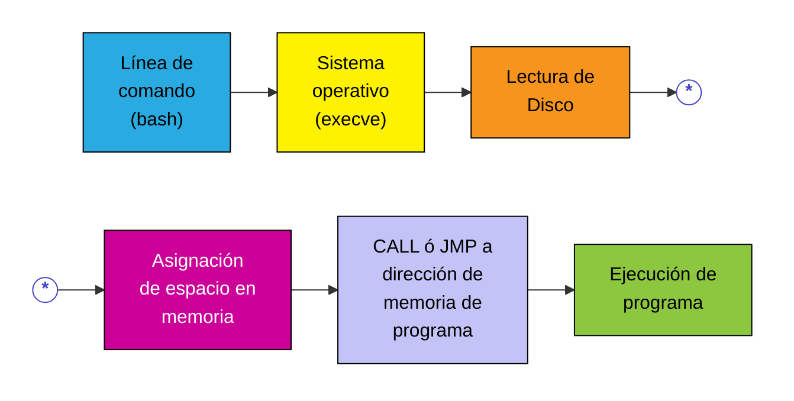
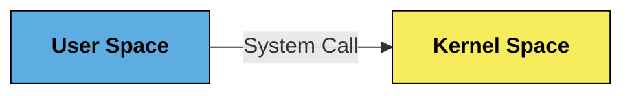

## Arquitecturas

Como podemos conocer, la arquitectura de una PC se compone de un procesador, memoria RAM y otros componentes según los requerimientos.
![[Pasted image 20260824135946.png|center|438]]

La PC es creación de IBM, pero a lo largo del tiempo se pudo replicar y por eso hay variedad de fabricantes. Se creó con la idea de Open Hardware, que es el equivalente a Open Source. Lo mismo pasa con los teléfonos entre Android y los Apple.  
![[Pasted image 20260824140103.png|center|357]]

¿Cuál es la diferencia entre una consola y una PC si tienen también un procesador AMD (clon de Intel)? Es por el Sistema Operativo y porque la consola está destinada sólo para juegos.

---
## Programas y Binarios

Tomemos el siguiente caso. La línea de comandos llama al sistema operativo, que lee nuestro `a.out` en el disco. Luego se fija si hay espacio en memoria y lo "sube", para luego hacer un `CALL` o `JMP` y leerlo. ¿Por qué lo sube en vez de leerlo de memoria? Porque la memoria es mucho más rápida. Por ejemplo, si el código reutiliza una función o usa ciclos, va a ser mucho más rápido leerlo si está en la memoria que volver al disco para buscar la instrucción. 


Cuando **compilamos** y **linkeditamos** con GCC, lo que pasa es lo siguiente. El GCC invoca primero al preprocesador CPP, el cual toma el código fuente original y realiza las macro expansiones de directivas como el `#include` o el `#define`. Luego, GCC toma la salida y convierte en código C al equivalente en ASM (por default en sintaxis AT&T), generando un `.S`. 

El compilador GNU de ASM se encarga de generar el código objeto (es decir en binario - extensión `.O`) para ser luego procesado por el microprocesador. Por último, el linkeditor crea el ejecutable, validando primero todas las referencias a funciones y uniendo los programas objetos necesarios. El archivo ejecutable es el archivo binario (código + syscalls) + header (propio de cada SO, contiene información para este).

---
## Programa en Memoria

Podemos representar un programa almacenado en memoria mediante el siguiente esquema:
![[Drawing 2026-08-24 20.49.29.excalidraw|center|250]]
Donde:
- **Código**: Instrucciones del programa
- **Datos**: Variables estáticas y globales que se inician al cargar el programa.
- **Heap**: Memoria dinámica que se reserva y se libera en tiempo de ejecución.
- **Pila (Stack)**: Argumentos y variables locales a la función.
![[Drawing 2026-08-24 21.03.03.excalidraw|center|500]]

Los **encabezados de archivo (header)** son la información para el sistema operativo que se agrega. En Linux, con el comando `file` podemos ver el encabezado de los archivos (en Linux no hay extensiones, entonces puedo guardar archivos ejecutables como `.jpg`, porque no significa nada).

Otro programa es `strings`, que va a extraer las partes de datos (de lo que vimos en el gráfico de arriba). Extrae todas las cadenas que tengan representación ASCII. 
```bash
osboxes@osboxes:~/arqui/ArquiTP1$ ./fortune_64
Bienvenido a al adibinador de la fortuna! Este mensaje es muy largo, y puede ser muy molesto al usuario. Tal vez deberiamos acortarlo?
Cual es tu nonbre?: Santiago

Tu fortuna es:
You will forget that you ever knew me.
osboxes@osboxes:~/arqui/ArquiTP1$
```

```bash
osboxes@osboxes:~/arqui/ArquiTP1$ strings fortune_64
/lib64/ld-linux-x86-64.so.2
libc.so.6
__isoc99_scanf
puts
__stack_chk_fail
printf
__libc_start_main
__gmon_start__
GLIBC_2.7
GLIBC_2.4
GLIBC_2.2.5
AWAVA
AUATL
[]A\A]A^A_
Break into jail and claim police brutality.
Never be led astray onto the path of virtue.
You will forget that you ever knew me.
Your society will be sought by people of taste and refinement.
You will be honored for contributing your time and skill to a worthy cause.
Expect the worst, it's the least you can do.
You may not get this fortune
Bienvenido a al adibinador de la fortuna! Este mensaje es muy largo, y puede ser muy molesto al usuario. Tal vez deberiamos acortarlo?
Cual es tu nonbre?:
Tu fortuna es:
;*3$"
```

Vemos todos los strings de los que se elige el de la "galleta de la fortuna". Además, vemos el `string` con la consigna.

¿Qué pasa si al ejecutable lo abrimos con un editor de texto? Vemos todos caracteres en desorden, porque trata de interpretar todo lo que ve. Si lo abrimos con un editor hexadecimal (bless), vemos nuevamente los strings. Lo que está en rojo es la posición relativa dentro del archivo.
![[Pasted image 20260824211308.png|center]]

Cada código que no tiene representación ASCII, lo pone como un punto. Como es un editor, donde está `adibinador` mal escrito podemos corregirlo. Notemos que esto va a correr, porque cambiamos un byte por otro byte. Como era un ejecutable, tiene un `checksum` que verifica que no sea modificado. En este caso corre, pero también vamos a poder modificar el `checksum`.

Con esto, concluímos que podemos editar un ejecutable y cambiar datos. ¿Vamos a poder cambiar el código? Si, lo vamos a poder llevar a Assembler y cambiar las instrucciones.

---
## Llamadas a Funciones

La instrucción `CALL` permite saltar a otra posición de memoria y correr una función extra. Es una instrucción de Assembler. En C lo hacíamos con el nombre de la función.
![[Drawing 2026-08-24 21.15.21.excalidraw|center|200]]

Una vez llamado, guarda en la pila (pushea) la dirección de retorno. La función debe terminar con la instrucción `RET` de Assembler, que es el equivalente al return de C. Lo que hace es "popear" la dirección de la pila y salta a esa posición. En cualquier lado donde pongamos `RET`, va a tomar la primera dirección en la pila y salta a ella, por eso es fundamental manejar bien la dirección guardada. 

>[!WARNING] Cuidado
>Vamos a tener que tener mucho cuidado, porque ahora la pila la vamos a manejar nosotros.

---
## System Calls

En vez de llamar a nuestras funciones, vamos a llamar al sistema operativo. Este es un programa que es siempre el primero que corre, solo antes de la BIOS, que es también un programa.
![[Drawing 2026-08-24 21.27.10.excalidraw|center|250]]

El **Kernel Space** es el lugar de memoria que toma el sistema operativo para ejecutarse. Además, los permisos son distintos. Todo lo que ejecutamos como la barra de tareas, como Chrome, se almacena en el **User Space**.

Supongamos que varios programas quieren acceder al teclado. El sistema operativo pone a disposición un montón de funciones, como acceder al teclado justamente. Estos son los System Calls. Gráficamente:


En Linux, tenemos el comando `strace` que permite ver todas los system calls. El siguiente ejemplo es un código en Pampero que es únicamente un print de "hola mundo".
```bash
svalles@pampero:~/arq$ strace ./holamundo
execve("./holamundo", ["./holamundo"], [/* 16 vars */]) = 0
brk(0)                                  = 0x9765000
access("/etc/ld.so.nohwcap", F_OK)      = -1 ENOENT (No such file or directory)
mmap2(NULL, 8192, PROT_READ|PROT_WRITE, MAP_PRIVATE|MAP_ANONYMOUS, -1, 0) = 0xb7733000
access("/etc/ld.so.preload", R_OK)      = -1 ENOENT (No such file or directory)
open("/etc/ld.so.cache", O_RDONLY|O_CLOEXEC) = 3
fstat64(3, {st_mode=S_IFREG|0644, st_size=43016, ...}) = 0
mmap2(NULL, 43016, PROT_READ, MAP_PRIVATE, 3, 0) = 0xb7728000
close(3)                                = 0
access("/etc/ld.so.nohwcap", F_OK)      = -1 ENOENT (No such file or directory)
open("/lib/i386-linux-gnu/libc.so.6", O_RDONLY|O_CLOEXEC) = 3
read(3, "\177ELF\1\1\1\0\0\0\0\0\0\0\0\0\3\0\3\0\1\0\0\0000\226\1\0004\0\0\0"..., 512) = 512
fstat64(3, {st_mode=S_IFREG|0755, st_size=1730024, ...}) = 0
mmap2(NULL, 1743580, PROT_READ|PROT_EXEC, MAP_PRIVATE|MAP_DENYWRITE, 3, 0) = 0xb757e000
mprotect(0xb7721000, 4096, PROT_NONE)  = 0
mmap2(0xb7722000, 12288, PROT_READ|PROT_WRITE, MAP_PRIVATE|MAP_FIXED|MAP_DENYWRITE, 3, 0x1a3) = 0xb7722000
mmap2(0xb7725000, 10972, PROT_READ|PROT_WRITE, MAP_PRIVATE|MAP_FIXED|MAP_ANONYMOUS, -1, 0) = 0xb7725000
close(3)                                = 0
mmap2(NULL, 4096, PROT_READ|PROT_WRITE, MAP_PRIVATE|MAP_ANONYMOUS, -1, 0) = 0xb757d000
set_thread_area({entry_number:-1 -> 6, base_addr:0xb757d900, limit:1048575, seg_32bit:1, contents:0, read_exec_only:0, limit_in_pages:1, seg_not_present:0, useable:1}) = 0
mprotect(0xb7722000, 8192, PROT_READ)   = 0
mprotect(0x8049000, 4096, PROT_READ)    = 0
mprotect(0xb7756000, 4096, PROT_READ)   = 0
munmap(0xb7728000, 43016)               = 0
fstat64(1, {st_mode=S_IFCHR|0620, st_rdev=makedev(136, 10), ...}) = 0
mmap2(NULL, 4096, PROT_READ|PROT_WRITE, MAP_PRIVATE|MAP_ANONYMOUS, -1, 0) = 0xb7732000
write(1, "Hola Mundo", 10Hola Mundo)    = 10
exit_group(0)                           = ?
```

Vemos casi al final el llamado a `write` con el `Hola Mundo`. Más arriba, también podemos ver un `open` con `libc`, que es la librería de c. 

A continuación tenemos algunos ejemplos de system calls en Linux (es anecdótico). Cada uno tiene un `id` que es único, y lo que está luego del "Source" son los argumentos que debe recibir. Los recibe por registros del procesador.

| `%eax` |     Name      |            Source            |      `%ebx`      |      `%ecx`      |  `%edx`  | `%esx` | `%edi` |
| :----: | :-----------: | :--------------------------: | :--------------: | :--------------: | :------: | :----: | :----: |
|   1    |  `sys_exit`   |       `kernel/exit.c`        |      `int`       |        -         |    -     |   -    |   -    |
|   2    |  `sys_fork`   | `arch/i386/kernel/process.c` | `struct pt_regs` |        -         |    -     |   -    |   -    |
|   3    |  `sys_read`   |      `fs/read_write.c`       |  `unsigned int`  |     `char *`     | `size_t` |   -    |   -    |
|   4    |  `sys_write`  |      `fs/read_write.c`       |  `unsigned int`  |  `const char *`  | `size_t` |   -    |   -    |
|   5    |  `sys_open`   |         `fs/open.c`          |  `const char *`  |      `int`       |  `int`   |   -    |   -    |
|   6    |  `sys_close`  |         `fs/open.c`          |  `unsigned int`  |        -         |    -     |   -    |   -    |
|   7    | `sys_waitpid` |       `kernel/exit.c`        |     `pid_t`      | `unsigned int *` |  `int`   |   -    |   -    |
|   8    |  `sys_creat`  |         `fs/open.c`          |  `const char *`  |      `int`       |    -     |   -    |   -    |
