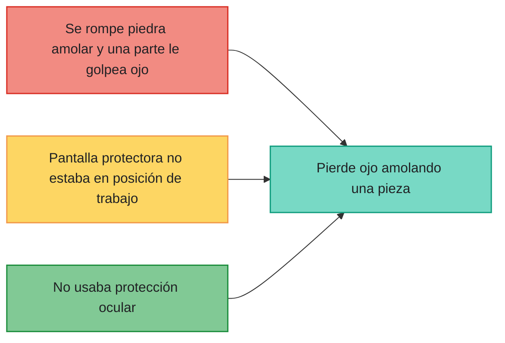
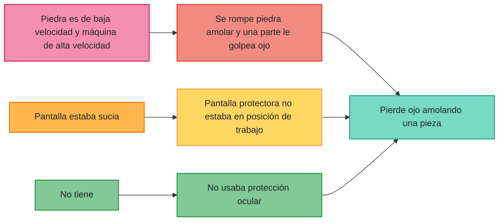
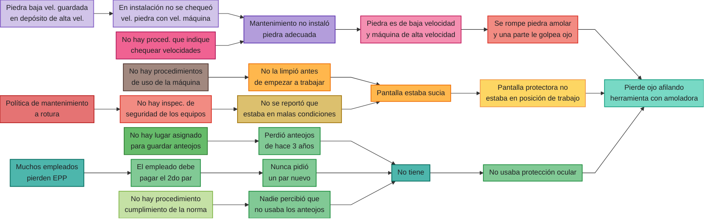

## Introducción

Antes de implementar un sistema de seguridad eficiente tanto de accidentes de trabajo como enfermedades profesionales, lo más importante es el **compromiso de la dirección**. Si la dirección de la compañía está comprometida en reducir la casuística, tanto en accidentes como en enfermedades profesionales, hay muchísimas más chances de que todos los esfuerzos que se inviertan en seguridad lleguen a buen puerto.

Pero si por otro lado no hay comunicación y/o algunos empleados, jefes o supervisores entran a la nave (donde se fabrican determinados productos de esta empresa) sin el casco, sin los zapatos de seguridad, sin los protectores oculares, etc., entonces hay un doble mensaje al resto de la compañía.

Es importante que la dirección de la compañía esté comprometida y lo transmita a todos los estados y a todos los niveles de la organización, empezando por la suscripción de una **política de seguridad**. Esta empresa suscribe en una fecha tal a ella y se compromete a que los empleados van a estar trabajando con todos los elementos de seguridad y se van a adoptar las mejores prácticas mundiales de seguridad, higiene y demás.

Alrededor del compromiso de la dirección, hay una serie de elementos como satélites complementarios a él.:
- Investigación y análisis de accidentes productivos .
- Análisis de seguridad de puestos de trabajo.
- Relevamientos e inspecciones de seguridad.
- Comité de seguridad: es un equipo multidisciplinario que se ocupa de auditar accidentes graves, o entre otras cosas también ir delineando los procedimientos de seguridad.
- Salud y primeros auxilios.
- Control de pérdidas catastróficas.

Nosotros nos vamos a centrar en dos de estos elementos, lo que es la investigación y análisis de accidente productivo, y por otro lado en lo que es el análisis de seguridad de puestos de trabajo.

---

## Investigación de Accidentes

Para poder hacer un buen diagnóstico de qué es lo que le ocurre a la empresa en términos de seguridad, accidentes y enfermedades profesionales, lo que tenemos que hacer es **investigar los accidentes**. 

Acá la pregunta es, en primer lugar, ¿qué accidentes vamos a investigar? En principio tendríamos que investigar **todos** los accidentes, no solamente los graves o los fatales, sino todos, pues un accidente leve hoy puede ser un accidente grave mañana.

Lo siguiente, es preguntar ¿quién investiga los accidentes? La recomendación es que sea el **supervisor**, porque él es la persona que más conoce al empleado y sabe de sus mañas, conoce si utiliza o no los elementos de protección personal que se le suministró, si está distraído, si no, si tiene un problema familiar, etc. Es la persona que tiene más información, y de alguna manera se pone a un mismo nivel de importancia a lo que es productividad, calidad y seguridad.

Ese supervisor se tiene que ocupar de que se cumplan las horas de trabajo en tiempo y forma, y se garanticen los estándares de producción, productividad, y al mismo tiempo calidad. Esto quiere decir, no tener irregularidades en el estado de los productos fabricados (algunos bien y otros mal). Entonces, a estas dos columnas de productividad y calidad le tenemos que agregar el término de seguridad, porque si no están los tres en un mismo nivel de importancia, no tenemos un negocio en equilibrio. De ahí que la persona más indicada para investigar un accidente justamente sea el supervisor, porque es él el que tiene que estar a cargo de sus empleados en todo sentido.

Ahora, ¿cuándo se investigan los accidentes? Lo más **pronto** posible. Tomemos el caso de un empleado que se resbala en una yerbatera en Misiones porque hay un charco de agua. A las dos horas, ese agua no está más; se evaporó. Entonces, puede haber desaparición de las evidencias, cambios, confusiones, etc. Entonces, no se debe dejar pasar el tiempo porque las evidencias se tergiversan o se  pierden. 

Por último, ¿dónde se investigan los accidentes? En el **lugar de trabajo**. Esto no es una operatoria que se realiza en forma remota en la oficina del muchacho de higiene y seguridad. No. Hay que investigar el accidente en el lugar de los hechos.

---
## Caso de Investigación

Tomemos el siguiente ejemplo. Tenemos a nuestro amigo José que trabaja frente a una amoladora. Esta persona pierde el ojo mientras estaba trabajando dicha herramienta. Entonces, vamos a preguntarnos como si fuéramos un investigador:
- ¿Qué? 
- ¿Quién? 
- ¿Cómo? 
- ¿Dónde? 
- ¿Cuándo? 
- ¿Por qué?

Pensemos, ¿qué hay detrás de que pierde el ojo amolando una pieza? Pierde el ojo amolando una pieza porque se rompe la piedra de molar y una parte le golpea el ojo. Es tan sencillo como eso, pero al mismo tiempo, lo pierde porque la pantalla protectora no estaba en posición de trabajo. Había una pantalla tipo acrílica o de policarbonato transparente que permite que la persona pueda estar trabajando sin que las chispas o algunas partículas que puedan llegar a ser despedidas desde la piedra molar le vayan directamente al rostro.

Pero acá por x motivos, que todavía no hemos podido dilucidar aún, esta pantalla protectora no estaba en posición de trabajo; estaba levantada. Entonces, pierde el ojo amolando una pieza porque no utilizaba protección ocular, no sabemos todavía por qué. Entonces, concentrando toda esta información en el siguiente diagrama, vemos que pierde el ojo amolando una pieza porque se rompe la piedra, porque la pantalla protector no estaba en posición de trabajo y no usaba protección ocular.



Si alguno de estos tres rectángulos de la izquierda no fuera cierto, el trabajador no hubiera perdido el ojo. El accidente no ocurre por casualidad, y en realidad no es casualidad la palabra indicada sino **causalidad**, y en este caso tenemos una multicausalidad. Son muchas causas que se producen simultáneamente las que generan el accidente. 

Pero notemos que estas mismas cajas, además de causas de la pérdida del ojo pueden ser consecuencias de otras causas que podríamos ubicar a su izquierda. Tomemos que se rompe la piedra amolar y una parte le golpea el ojo. ¿Por qué ocurre? Podría ser porque la piedra es de baja velocidad y la máquina es de alta velocidad. Esta piedra esmeril giraba a, supongamos, 4000 revoluciones por minuto, pero estaba diseñada para girar a 2500 revoluciones por minuto. Ya por diseño estaba siendo sometida a un estrés físico que no toleró. Entonces por eso se rompe la piedra. Lo mismo podríamos hacer para las otras causas (ahora consecuencias) y armar el siguiente esquema:

Pero a su vez, pensemos, ¿por qué se tenía una piedra de baja velocidad funcionando como una de alta? Podríamos pensar que el mantenimiento no instaló la piedra adecuada, o en la instalación no se chequeó la velocidad de la piedra con la de la máquina, o la piedra de baja velocidad se guardó en el depósito, etc.

Si vemos la parte derecha de la pantalla, pareciera ser que la responsabilidad de la ocurrencia de este accidente es pura y exclusivamente de José. Pero si vamos navegando hacia la izquierda y vemos que mantenimiento no instaló la piedra adecuada. Acá ya la responsabilidad pasa a ser, no tanto de José, sino de un mando medio, de un supervisor o de un jefe del sector. Y si nos vamos más a la izquierda aún, ya empezamos a ver que capaz no hay procedimientos de uso de la máquina, no hay inspección de seguridad de equipos. etc. Y eso no es un tema de José, pero tampoco del inmediato superior. Viene de más arriba, ya es un tema de la dirección de la compañía.

---
## Formulario de Investigación

Ahora, ¿qué hacemos con toda esta información? Una vez que conocemos el qué, quién, cómo, dónde, cuándo y por qué, en la parte inferior del **formulario de investigación de accidentes** vamos a poner, con nombre y apellido, quiénes son los responsables de implementación de las medidas correctivas, para que esta investigación sea productiva. Además, se debe agregar cuándo se tienen que hacer esas medidas correctivas. En definitiva:
- ¿Cuáles son las medidas correctivas que tengo que implementar para evitar la recurrencia? 
- ¿Quién se va a hacer cargo de la implementación de esas medidas? 
- ¿En qué plazos? 

---
## Clasificación de Accidentes

Para poder armar esta clasificación vamos a introducir dos conceptos. Para hacerlo, vamos a tomar el ejemplo de la caída de un trabajador:
- **Tipo de Accidente**: Se responde con la pregunta ¿cómo ocurrió? Para nuestro ejemplo, podría ser por un movimiento manual (MM).
- **Agente del Accidente**: Se responde con la pregunta ¿qué lo generó? Para nuestro ejemplo, podría ser un piso en mal estado.

Tenemos el siguiente cuadro:

| **FORMA**                                                                                                                                                        | **EJEMPLO DE AGENTES**                                                                                                                  |
| ---------------------------------------------------------------------------------------------------------------------------------------------------------------- | --------------------------------------------------------------------------------------------------------------------------------------- |
| **Caídas :**<br>- **Caída a nivel**<br>- **Resbalón**<br>- **Tropezón**<br>- **Caída desde altura**                                                              | Piso en mal estado<br>Piso mojado<br>Pallet en área de circulación.<br>Deslizamiento de escalera.                                       |
| **Movimiento Manual:**<br>- **MM-caída de objeto**<br>- **MM-caída de persona**<br>- **MM-trasladar**<br>- **MM-empujar**<br>- **MM-levantar**<br>- **MM-otros** | Caja (se cae la caja al transportarla).<br>Perfil (se cae la persona al transportarlo)<br>Balde<br>Portón<br>Tambor de cola<br>Alambre. |
| **Golpeado contra**                                                                                                                                              | Cañería (la persona golpea al objeto).                                                                                                  |
| **Golpeado por**                                                                                                                                                 | Puerta de tolva (el objeto golpea a la persona)                                                                                         |
| **Proyección**                                                                                                                                                   | Soda cáustica, polvo detergente.                                                                                                        |
| **Inhalación**                                                                                                                                                   | Cloro                                                                                                                                   |
| **Herramienta manual**                                                                                                                                           | Martillo.                                                                                                                               |
| **Herramienta mecánica**                                                                                                                                         | Taladro, sierra, etc.                                                                                                                   |
| **Manipuleo mecánico**                                                                                                                                           | Aparejo.                                                                                                                                |
| **Máquina-punto de trabajo**                                                                                                                                     | Rodillos, punto de desbaste o aplastamiento                                                                                             |
| **Máquina transmisión**                                                                                                                                          | Correas, engranajes, poleas, cadenas, etc.                                                                                              |
| **Riesgo eléctrico**                                                                                                                                             | Tablero eléctrico, contactor, etc.                                                                                                      |
| **Vehículo de planta**                                                                                                                                           | Auto elevador, zorra eléctrica.                                                                                                         |
| **Vehículo de calle**                                                                                                                                            | Choque con auto realizando tareas laborales.                                                                                            |
| **In Itinere**                                                                                                                                                   | Choque del colectivo, bicicleta.                                                                                                        |
| **Otros**                                                                                                                                                        | No incluidos en otra categoría                                                                                                          |

---
## Análisis de Accidentes

La información obtenida se vuelca a una planilla indicando:
- Fecha
- Días perdidos
- Nombre
- Tipo
- Parte afectada
- Agente
- Tipo de lesión
- Locación (si la empresa tuviera varias plantas)

Podemos tomar el siguiente ejemplo de recorte de una planilla:

| **Nro.** | **Fecha** | **Nombre** | **Parte Afect. | **Tipo Lesión** | **Días Perd.** | **Tipo**                 | **Agente**         | **Loc.**   |
| -------- | --------- | ---------- | -------------- | --------------- | -------------- | ------------------------ | ------------------ | ---------- |
| 25       | 25/07/96  | XXXXXXX    | MANO           | TRAUMATISMO     | 177            | MM - CAIDA DE OBJETO     | PALLET VACIO       | MENDOZA    |
| 26       | 25/07/96  | XXXXXXX    | PIE            | FRACTURA        | 114            | VEHÍCULO DE PLANTA       | AUTOELEVADOR       | CORDOBA    |
| 27       | 26/07/96  | XXXXXXX    | MUSLO          | DESGARRO        | 9              | CAIDA A NIVEL - RESBALON | ??????             | CORRIENTES |
| 28       | 27/07/96  | XXXXXXX    | PIERNA         | TRAUMATISMO     | 9              | CAIDA A NIVEL - RESBALON | RODILLO TRANSPORTE | MENDOZA    |

Mirando estos datos, podríamos realizar un análisis y ver: 370 accidentes en 6 meses. Esto, ¿es mucho o poco? La respuesta es **depende de la masa trabajadora** de la empresa, pues no es lo mismo ese número de accidentes en un total de 500 trabajadores que en un total de 10000. Entonces, vamos a hacer un pequeño gráfico de tendencias de accidente con los meses de ocurrencia. El mismo consiste en la **incidencia**, que es básicamente una extrapolación.
$$\text{Incidencia} = \frac{\text{Accidentes} \times 12}{\text{Trabajadores}} \times 100$$
Con esto, podemos obtener la proporción de accidentes al año cada 100 trabajadores.

Así, podemos armar una tabla como la siguiente:

| **Mes**      | **Accidentes** | **Trabajadores** | **Incidencia** |
| ------------ | -------------- | ---------------- | -------------- |
| Julio        | 36             | 3176             | 13,60          |
| Agosto       | 66             | 3154             | 25,11          |
| Setiembre    | 67             | 3173             | 25,34          |
| Octubre      | 65             | 3157             | 24,71          |
| Noviembre    | 70             | 3173             | 26,47          |
| Diciembre    | 66             | 3210             | 24,67          |
| **Promedio** | **61,67**      | **3174**         | **23,32**      |

Y al mismo tiempo, construir el gráfico:
```tikz
\usepackage{pgfplots}
\pgfplotsset{compat=1.16}
\begin{document}

\begin{tikzpicture}
\begin{axis}[
    width=12cm,
    height=8cm,
    xlabel={\textbf{Meses}},
    ylabel={Incidencia},
    ymin=10, ymax=30,
    ytick={10,15,20,25,30},
    yticklabels={10,00, 15,00, 20,00, 25,00, 30,00},
    symbolic x coords={Jul,Ago,Sep,Oct,Nov,Dic},
    xtick=data,
    axis lines=box,
    grid=both,
    grid style={line width=0.6pt, draw=black},
    major grid style={line width=0.6pt, draw=black},
    axis background/.style={fill=yellow!25},
    legend pos=outer north east,
    legend cell align={left},
    tick label style={font=\small},
    label style={font=\bfseries\small},
]

\addplot[color=blue!30!black, line width=2.2pt, mark=none]
    coordinates {
    (Jul,13.5) (Ago,25.1) (Sep,25.3)
    (Oct,24.7) (Nov,26.3) (Dic,24.7)
};
\addlegendentry{Incidencia}

\addplot[color=red, line width=1.8pt, mark=none]
    coordinates {
    (Jul,23.2) (Ago,23.2) (Sep,23.2)
    (Oct,23.2) (Nov,23.2) (Dic,23.2)
};
\addlegendentry{Promedio}

\addplot[color=green!70!lime, line width=1.8pt, mark=none, smooth]
    coordinates {
    (Jul,17.0) (Ago,20.6) (Sep,23.2)
    (Oct,25.1) (Nov,26.5) (Dic,27.4)
};
\addlegendentry{Tendencia}

\end{axis}
\end{tikzpicture}

\end{document}
```

Luego, se pueden ordenar los accidentes por locación y por tipo para así ir segmentando cuáles son las provincias o las ciudades en donde más accidentes ocurren. Se obtiene algo de la siguiente forma:

| **Locación**       | **Cantidad de casos** | **%**       |
| ------------------ | --------------------- | ----------- |
| Mendoza            | 119                   | 32,16%      |
| Rosario            | 113                   | 30,54%      |
| Corrientes         | 52                    | 14,05%      |
| Córdoba            | 44                    | 11,89%      |
| Tucumán            | 23                    | 6,22%       |
| Bahía Blanca       | 7                     | 1,89%       |
| Neuquén            | 5                     | 1,35%       |
| Jujuy              | 3                     | 0,81%       |
| Posadas            | 2                     | 0,54%       |
| Comodoro Rivadavia | 1                     | 0,27%       |
| San Luis           | 1                     | 0,27%       |
| **Total**          | **370**               | **100,00%** |

Así, se puede generar el siguiente gráfico para poder dimensionarlo de mejor manera:
```tikz
\usepackage{pgfplots}
\pgfplotsset{compat=1.16}
\begin{document}

\begin{tikzpicture}
\begin{axis}[
    width=16cm,
    height=9cm,
    title={\textbf{Cantidad de Casos por Locación}},
    ybar,
    bar width=16pt,
    ymin=0, ymax=130,
    ytick={0,20,40,60,80,100,120},
    symbolic x coords={Mendoza,Rosario,Corrientes,Córdoba,Tucumán,Bahía Blanca,Neuquén,Jujuy,Posadas,Comodoro Rivadavia,San Luis},
    xtick=data,
    x tick label style={rotate=45, anchor=east, font=\small},
    axis lines=left,
    enlarge x limits=0.05,
    nodes near coords,
    every node near coord/.append style={font=\scriptsize},
    tick label style={font=\small},
    title style={font=\bfseries},
    ymajorgrids=true,
    grid style={line width=0.4pt, draw=gray!40},
]

\addplot[
    fill=blue!45,
    draw=blue!70!black,
    line width=0.8pt,
] coordinates {
    (Mendoza,119)
    (Rosario,113)
    (Corrientes,52)
    (Córdoba,44)
    (Tucumán,23)
    (Bahía Blanca,7)
    (Neuquén,5)
    (Jujuy,3)
    (Posadas,2)
    (Comodoro Rivadavia,1)
    (San Luis,1)
};

\end{axis}
\end{tikzpicture}

\end{document}
```

Vemos que claramente, Mendoza lidera la cantidad de casos, por lo que vamos a ponernos otros lentes y realizar un análisis con mayor detalle. Vamos a ver con qué tipos de accidentes se relacionan los 119 de esa locación.

| **Tipo de accidente**   | **Cantidad de casos** | **%**       | **% Acum**  |
| ----------------------- | --------------------- | ----------- | ----------- |
| Manipuleo de materiales | 24                    | 20,17%      | 20,17%      |
| Caída a nivel           | 17                    | 14,29%      | 34,45%      |
| Proyección              | 14                    | 11,76%      | 46,22%      |
| Vehículo de calle       | 12                    | 10,08%      | 56,30%      |
| In itinere              | 11                    | 9,24%       | 65,55%      |
| Golpea contra           | 8                     | 6,72%       | 72,27%      |
| Herramienta manual      | 8                     | 6,72%       | 78,99%      |
| Vía pública             | 6                     | 5,04%       | 84,03%      |
| Sin identificar         | 5                     | 4,20%       | 88,24%      |
| Vehículo de planta      | 4                     | 3,36%       | 91,60%      |
| Caída desde altura      | 4                     | 3,36%       | 94,96%      |
| Máquina                 | 3                     | 2,52%       | 97,48%      |
| Otros                   | 2                     | 1,68%       | 99,16%      |
| Golpeado por            | 1                     | 0,84%       | 100,00%     |
| **Total**               | **119**               | **100,00%** | **100,00%** |

Podemos verlo gráficamente:
```tikz
\usepackage{pgfplots}
\begin{document}

\begin{tikzpicture}

% --- T\'itulo ---
\node[font=\bfseries\large] at (0,5.3) {Tipos de accidentes Mendoza};

% --- Definici\'on de colores ---
\definecolor{cManipuleo}{RGB}{124,124,180}
\definecolor{cCaida}{RGB}{40,180,80}
\definecolor{cProyeccion}{RGB}{230,230,180}
\definecolor{cVehCalle}{RGB}{150,150,150}
\definecolor{cInItinere}{RGB}{210,20,20}
\definecolor{cGolpeaContra}{RGB}{240,140,140}
\definecolor{cHerramienta}{RGB}{120,190,190}
\definecolor{cViaPublica}{RGB}{70,110,160}
\definecolor{cSinIdent}{RGB}{20,30,90}
\definecolor{cVehPlanta}{RGB}{210,20,210}
\definecolor{cCaidaAltura}{RGB}{230,230,40}
\definecolor{cMaquina}{RGB}{20,140,140}
\definecolor{cOtros}{RGB}{100,150,100}
\definecolor{cGolpeadoPor}{RGB}{170,170,170}

% --- Porciones de la torta (radio 2.5) ---
\draw[fill=cManipuleo]   (0,0) -- (90:2.5)     arc (90:17.39:2.5)    -- cycle;
\draw[fill=cCaida]       (0,0) -- (17.39:2.5)  arc (17.39:-34.02:2.5) -- cycle;
\draw[fill=cProyeccion]  (0,0) -- (-34.02:2.5) arc (-34.02:-76.39:2.5) -- cycle;
\draw[fill=cVehCalle]    (0,0) -- (-76.39:2.5) arc (-76.39:-112.68:2.5) -- cycle;
\draw[fill=cInItinere]   (0,0) -- (-112.68:2.5) arc (-112.68:-145.98:2.5) -- cycle;
\draw[fill=cGolpeaContra](0,0) -- (-145.98:2.5) arc (-145.98:-170.17:2.5) -- cycle;
\draw[fill=cHerramienta] (0,0) -- (-170.17:2.5) arc (-170.17:-194.36:2.5) -- cycle;
\draw[fill=cViaPublica]  (0,0) -- (-194.36:2.5) arc (-194.36:-212.51:2.5) -- cycle;
\draw[fill=cSinIdent]    (0,0) -- (-212.51:2.5) arc (-212.51:-227.66:2.5) -- cycle;
\draw[fill=cVehPlanta]   (0,0) -- (-227.66:2.5) arc (-227.66:-239.76:2.5) -- cycle;
\draw[fill=cCaidaAltura] (0,0) -- (-239.76:2.5) arc (-239.76:-251.86:2.5) -- cycle;
\draw[fill=cMaquina]     (0,0) -- (-251.86:2.5) arc (-251.86:-260.93:2.5) -- cycle;
\draw[fill=cOtros]       (0,0) -- (-260.93:2.5) arc (-260.93:-266.98:2.5) -- cycle;
\draw[fill=cGolpeadoPor] (0,0) -- (-266.98:2.5) arc (-266.98:-270:2.5)   -- cycle;

% --- Etiquetas de porcentaje: normales (radio fijo 3.1) ---
\node[font=\small] at (53.7:3.1)   {20\%};
\node[font=\small] at (-8.3:3.1)   {14\%};
\node[font=\small] at (-55.2:3.1)  {12\%};
\node[font=\small] at (-94.5:3.1)  {10\%};
\node[font=\small] at (-129.3:3.1) {9\%};
\node[font=\small] at (-158.1:3.1) {7\%};
\node[font=\small] at (-182.3:3.2) {7\%};
\node[font=\small] at (-203.4:3.2) {5\%};
\node[font=\small] at (-220.1:3.2) {4\%};

% --- Etiquetas de las 4 porciones chicas de arriba: radios escalonados + l\'ineas gu\'ia ---
\draw[gray, thin] (114.2:2.5) -- (114.2:3.0);
\node[font=\small] at (114.2:3.2) {3\%};

\draw[gray, thin] (103.6:2.5) -- (103.6:3.5);
\node[font=\small] at (103.6:3.7) {3\%};

\draw[gray, thin] (96.0:2.5) -- (96.0:4.0);
\node[font=\small] at (96.0:4.2) {2\%};

\draw[gray, thin] (91.5:2.5) -- (91.5:4.5);
\node[font=\small] at (91.5:4.7) {1\%};

% --- Leyenda: 2 columnas x 7 filas, bien espaciadas ---
\draw (-6.3,-4.8) rectangle (6.3,-9.0);

\foreach \k/\color/\label/\x/\y in {
    0/cManipuleo/{Manipuleo de materiales}/-6.0/-5.3,
    1/cCaida/{Ca\'ida a nivel}/0.2/-5.3,
    2/cProyeccion/{Proyecci\'on}/-6.0/-5.9,
    3/cVehCalle/{Veh\'\i culo de calle}/0.2/-5.9,
    4/cInItinere/{In itinere}/-6.0/-6.5,
    5/cGolpeaContra/{Golpea contra}/0.2/-6.5,
    6/cHerramienta/{Herramienta manual}/-6.0/-7.1,
    7/cViaPublica/{V\'ia p\'ublica}/0.2/-7.1,
    8/cSinIdent/{Sin identificar}/-6.0/-7.7,
    9/cVehPlanta/{Veh\'\i culo de planta}/0.2/-7.7,
    10/cCaidaAltura/{Ca\'ida desde altura}/-6.0/-8.3,
    11/cMaquina/{M\'aquina}/0.2/-8.3,
    12/cOtros/{Otros}/-6.0/-8.9,
    13/cGolpeadoPor/{Golpeado por}/0.2/-8.9
} {
    \fill[\color] (\x,\y) rectangle ++(0.25,0.25);
    \node[anchor=west, font=\scriptsize] at (\x+0.35,\y+0.125) {\label};
}

\end{tikzpicture}

\end{document}
```

Vemos que movimiento manual de materiales y caídas a nivel tienen entre ambos 20% y 14% del total. Agregando proyección se llevan casi la mitad de todos los casos de Mendoza. Si nos vamos a otras provincias, tenemos los mismos tres tipos en los primeros lugares, lo que es lógico dada la actividad de la empresa. Podríamos también pensar en hacer un ordenamiento por sector, y veríamos otros resultados.

Entonces, pensemos qué sucedería si logramos hacer una intersección de:
- Tipo de Accidente
- Agente
- Sector
- Ubicación

Con esto, podemos analizar cuáles son las **fuentes de pérdida**, tomando una tabla como la que vemos a continuación.

| **Tipo de Accidente**   | **Sector**               | **Agente**     | **Ocup.** | **Casos** | **%**      |
| ----------------------- | ------------------------ | -------------- | --------- | --------- | ---------- |
| Manipuleo de materiales | Depósito producto        | Cajones        | Operario  | 6         | 5,04%      |
| Manipuleo de materiales | Depósito producto        | Pack           | Operario  | 6         | 5,04%      |
| Caída a nivel           | Línea envasado 1         | Escalera       | Operario  | 4         | 3,36%      |
| Caída a nivel           | Vestuario                | Escalera       | Operario  | 4         | 3,36%      |
| Caída a nivel           | Línea envasado 2         | Tarima         | Operario  | 3         | 2,52%      |
| Caída desde altura      | Mantenimiento            | Escalera       | Oficial   | 3         | 2,52%      |
| Herramienta manual      | Línea de empaque         | Cutter         | Operario  | 3         | 2,52%      |
| Manipuleo de materiales | Línea envasado 1         | Botella        | Operario  | 3         | 2,52%      |
| Proyección              | Línea lavado de botellas | Vidrio botella | Operario  | 3         | 2,52%      |
| Proyección              | Línea de envasado 1      | Cuerpo extraño | Operario  | 3         | 2,52%      |
| **Total**               |                          |                |           | **38**    | **31,93%** |

Con esto, logramos ver que debemos que ir a estos lugares para ver bien en detalle qué es lo que está ocurriendo, y a partir de ahí, revisar los elementos de protección personal y si hay procedimientos de trabajo seguro.