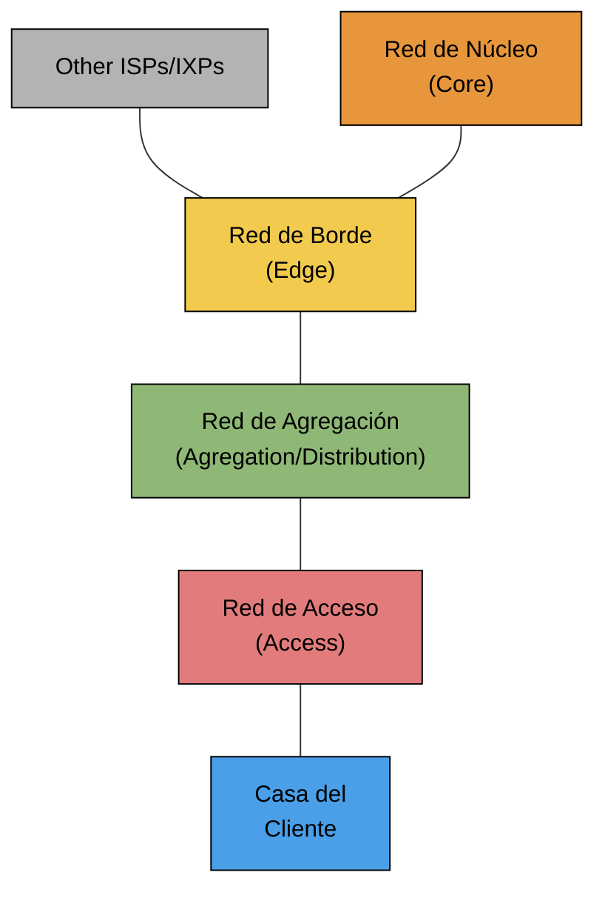

## Arquitectura de ISPs

La arquitectura de un ISP se organiza en capas jerárquicas que van desde la casa del cliente hasta el resto de Internet: red de acceso, red de agregación/distribución, red de borde (edge) y red de núcleo (core). Cada capa va consolidando el tráfico de la anterior, de modo que el volumen de datos que maneja crece a medida que uno se acerca al core, mientras que la cantidad de enlaces individuales disminuye. Esta jerarquía es lo que permite escalar la red sin que cada usuario necesite un enlace directo hasta el núcleo.


Donde:
- **Access Network**: red de acceso que llega hasta la casa del usuario.
- **Aggregation Network**: también llamada red de distribución. Red de múltiples capas que va consolidando el tráfico de diferentes partes de la red de acceso.
- **Edge Network**: red de borde. Se usa tanto como borde de la red de interior (hacia los usuarios) como de la red exterior (hacia internet)
	- Red que termina el tráfico de los usuarios donde son autenticados y se controla el ancho de banda (esto también puede hacerse en la red de acceso)
	- Red donde se interconecta con otras redes ( ISPs/IXP )
- **Core Network**: red de núcleo es la red que interconecta a todo el ISP internamente. En particular conecta los Edge entre sí.

Llevado a equipamiento concreto: el CPE del cliente se conecta a través de la access network (fibra, cable o DSL) a un access concentrator, que según la tecnología puede ser un OLT, un CMTS o un DSLAM. Ese tráfico se agrega en un switch de agregación, sube a un edge router (también llamado BNG o B-RAS, responsable de autenticar y limitar ancho de banda) y de ahí llega a los core routers. En paralelo, en el borde también hay peering routers que conectan con otros ISPs o con un IXP para intercambiar tráfico hacia el resto de Internet.
![[Pasted image 20260908182228.png|center|460]]

---
## Network Address Translation (NAT)

**[[06. Capa de Red#SNAT (Network Address Translation)|NAT (Network Address Translation)]]** no tiene un estándar detallado a nivel de implementación; el RFC 1631 que lo define es bastante general, por lo que cada fabricante resuelve los detalles a su manera. El NAT tradicional fue pensado para el modelo cliente/servidor: solo traduce y deja pasar conexiones que se originaron desde adentro de la red privada hacia afuera, es decir, no acepta conexiones entrantes salvo que ya exista una sesión saliente asociada a esa dirección y puerto.

Un error común es asumir que NAT desaparece con la adopción de IPv6, ya que al haber direcciones de sobra no haría falta traducir por escasez de direcciones. Sin embargo, NAT se sigue usando porque hay motivos independientes de eso: siguen existiendo firewalls que filtran tráfico entre redes, y sigue existiendo la separación entre redes públicas y privadas, y ambas cosas justifican mantener mecanismos de traducción o control de acceso más allá del protocolo de capa de red que se use.

Hay que tener en cuenta que NAT tiene que hacer **snooping** del protocolo de capa cuatro para poder obtener el puerto (que se define a nivel transporte, TCP/UDP). Adicionalmente, debe:
- **En TCP**: mira el estado de la sesión, tal que cuando la sesión termina automáticamente libere la `IP:puerto` externa para que la pueda usar otra conexión.
- **En UDP**: dado que no tiene estado, la única forma que tiene de hacer este trackeo es con un timeout desde el último paquete recibido en esa relación `IP:puerto` externa.


**Source NAT (SNAT)** se usa cuando un dispositivo de la red privada (A) inicia una conexión hacia uno de la red pública (B, típicamente un servidor). El NAT ve salir el paquete con la IP y puerto privados de A como origen, y los traduce reemplazándolos por su propia IP pública y un puerto asignado, dejando intacto el destino (B). Internamente guarda esa asociación en una tabla de mapeo (bindeo) entre `IPA:PortA` e `IPNPub:PortNPub`.
![[Pasted image 20260908182659.png|center|543]]

Cuando B responde, el paquete llega al NAT con destino IPNPub:PortNPub; el NAT busca esa entrada en la tabla y hace la traducción inversa sobre el campo destino, reemplazándolo por IPA:PortA, de modo que el paquete llegue correctamente al dispositivo interno que originó la conexión.

**Destination NAT (DNAT)** es el caso inverso: se usa cuando un dispositivo de la red pública (A) necesita iniciar una conexión hacia uno que está en la red privada (B), típicamente un servidor publicado detrás del NAT. El paquete entrante llega con destino `IPNPub:PortNPub`, y el NAT traduce ese campo reemplazándolo por la IP y puerto privados reales de B antes de reenviarlo hacia adentro de la red.
![[Pasted image 20260908182836.png|center|542]]
Cuando B responde, el NAT hace la traducción inversa pero ahora sobre el campo origen: reemplaza `IPB:PortB` por `IPNPub:PortNPub`, de forma que para A la respuesta parezca venir de la dirección pública conocida y no de la dirección privada real de B.

---
## Tipos de NAT

Dentro del SNAT (Source NAT) existen distintas variantes según qué tan restrictivas son a la hora de aceptar tráfico entrante sobre una asociación ya creada. La diferencia entre ellas pasa por qué combinación de IP y puerto externos tiene permitido enviar tráfico de vuelta hacia el mapeo que generó el NAT.

**NAT – Full Cone** es el tipo menos restrictivo. Una vez que A abre una conexión saliente y el NAT crea la asociación (`Aa:Ap`, `Na:Np`) hacia el exterior, cualquier host externo puede enviarle tráfico a esa IP y puerto públicos (`Na:Np`) y el NAT lo va a reenviar hacia A, sin importar quién sea el origen ni desde qué IP o puerto venga. Por eso la asociación se resume como `(Aa:Ap, Na:Np) <=> *:*`. Esto lo hace muy poco seguro para conexiones entrantes arbitrarias, pero es el comportamiento típico que se usa para publicar servidores con mapeo estático.
![[Pasted image 20260908183620.png|center|473]]

En **NAT – IP Restricted**, el NAT sí impone una restricción, pero solo sobre la dirección IP de origen del tráfico entrante. Una vez que A se comunicó con B, cualquier puerto de B puede responder hacia `Na:Np` y el NAT lo deja pasar, pero un host C que nunca haya sido contactado por A queda bloqueado aunque intente usar la misma `Na:Np`. La asociación queda como `(Aa:Ap, Na:Np) <=> B:*`, es decir, se valida la IP del remoto pero no su puerto.
![[Pasted image 20260908183741.png|center|482]]

**NAT – Port Restricted** es un paso más estricto que el anterior. No alcanza con que el tráfico entrante venga de la IP de B, también tiene que venir exactamente del mismo puerto (`Bp`) que A contactó originalmente. Si B intenta responder desde un puerto distinto (`Ba:!Bp`), el NAT lo descarta. La asociación se expresa como `(Aa:Ap, Na:Np) <=> B:Bp`, validando tanto IP como puerto del extremo remoto.
![[Pasted image 20260908183832.png|center|445]]

**NAT – Symmetric** es el tipo más restrictivo y el que más rompe con el modelo de "un solo mapeo público por host interno". Acá el NAT no reutiliza el mismo `Na:Np` para todos los destinos, sino que genera un puerto público distinto por cada combinación de destino (`IP:puerto`). Por ejemplo, la conexión de A hacia B usa `Na:Np`, pero la conexión de A hacia C usa un puerto distinto (`Na:N'p`), aunque sea el mismo A originándolas. Esto complica bastante técnicas como el hole punching para P2P, porque no se puede predecir qué puerto público va a usar el NAT para un nuevo destino a partir de lo que se vio con otro. La asociación es `(Aa:Ap, Na:Np) <=> B : Bp`.
![[Pasted image 20260908184125.png|center|428]]
Notemos la siguiente diferenciación:
- En Full Cone, IP Restricted y Port Restricted, la asociación es de `Aa:Ap` a `Na:Np` para todos los `Xa:Xp` que se conecten desde ese mismo `Aa:Ap`. Trata de respetar que `Np = Ap`. ![[Pasted image 20260908184305.png|center|539]]
- En Symmetric, para cada `Xa:Xp` que se conecte desde `Aa:Ap` se elige un `Na:Np` distinto por más que el `Aa:Ap` sea el mismo. Nunca es `Np = Ap` excepto de casualidad. ![[Pasted image 20260908184409.png|center|525]]
---
## NAT Traversal

Pensemos cómo podemos lograr que dos hosts que están cada uno detrás de su propio NAT/firewall puedan establecer una conexión directa entre sí, algo típico en aplicaciones P2P o VoIP. La dificultad es que ninguno de los dos puede recibir conexiones entrantes sin que exista antes una asociación creada por una conexión saliente propia, y no es viable que el administrador de cada red cree manualmente una regla de NAT entrante para cada cliente posible con el que alguien podría querer comunicarse. Para resolver esto existen técnicas como UDP Hole Punching, STUN, TURN e ICE, que buscan de distintas formas "adivinar" o coordinar el mapeo público que cada NAT le asignó a cada host para poder atravesarlo.

>[!WARNING] Cuidado
>Crear reglas de NAT entrantes para todos los clientes posibles no es una solución escalable.


**Double NAT (SNAT & DNAT)** aparece cuando el cliente está en una red pública (o al menos distinta) y el servidor con el que quiere hablar está en una red privada, publicado detrás de un NAT. Ahí se combinan las dos traducciones que ya vimos por separado: al salir, el paquete de A sufre un SNAT en su propio NAT (cambia su IP privada por la pública); al llegar al NAT del servidor, sufre un DNAT que traduce la IP pública de destino por la IP privada real de B. La vuelta hace el camino inverso: B responde y su NAT le aplica SNAT para que la respuesta parezca venir de la IP pública, y al llegar al NAT de A se le aplica DNAT para redirigirla hacia la IP privada real de A.
![[Pasted image 20260908185505.png|center|513]]

**Double NAT (SNAT & SNAT)** es el escenario típico de una conexión P2P real: A y B están cada uno detrás de su propio NAT, y ninguno de los dos tiene una regla de DNAT configurada de antemano (porque no es práctico configurar manualmente una regla por cada posible peer). Entonces ambos NATs solo aplican SNAT sobre el tráfico saliente de su respectivo host, pero como no hay ninguna regla que permita el tráfico entrante desde el otro lado, ninguno puede alcanzar directamente al otro sin recurrir a alguna de las técnicas de NAT traversal mencionadas antes.
![[Pasted image 20260908185551.png|center|489]]

---
## UDP Hole

**UDP Hole** resuelve el problema de conectar dos PCs detrás de NAT/firewall sin depender de un tercero en el momento de la conexión, pero exige una condición fuerte: que ambos lados ya conozcan de antemano el puerto UDP público que va a usar el otro extremo, y que el firewall no cambie ese puerto entre conexiones (es decir, que no sea un NAT Symmetric). Como cada PC sabe el puerto público del otro de antemano, ambas pueden mandar tráfico UDP saliente hacia la `IP:puerto` público del otro al mismo tiempo, y como cada NAT ve que ese tráfico entrante coincide con una asociación que él mismo generó al mandar tráfico saliente hacia esa dirección, lo deja pasar.
![[Pasted image 20260908185705.png|center|370]]

En la práctica esto se ve con una herramienta como `nat-traverse`, donde cada usuario le indica manualmente su puerto local y la `IP:puerto público` del otro extremo (por ejemplo `nat-traverse 40001:pampero.itba.edu.ar:40000` de un lado y el mapeo inverso del otro). El siguiente caso con `tcpdump` muestra justamente eso: paquetes UDP saliendo repetidamente desde el puerto local hacia el destino remoto (los intentos de "perforar el agujero"), hasta que en un momento empieza a llegar tráfico UDP en sentido contrario, señal de que ambos NATs ya aceptan el tráfico entrante mutuo y la comunicación quedó establecida.
```bash
srv@srv-nb:~$ sudo tcpdump udp -i eth2 | grep 4000
tcpdump: verbose output suppressed, use -v or -vv for full protocol decode
listening on eth2, link-type EN10MB (Ethernet), capture size 65535 bytes
00:57:43.481685 IP srv-nb.local.40001 > pampero.it.itba.edu.ar.40000: UDP, length 20
00:57:45.482073 IP srv-nb.local.40001 > pampero.it.itba.edu.ar.40000: UDP, length 20
00:57:47.482508 IP srv-nb.local.40001 > pampero.it.itba.edu.ar.40000: UDP, length 20
00:57:49.482922 IP srv-nb.local.40001 > pampero.it.itba.edu.ar.40000: UDP, length 20
00:57:51.483405 IP srv-nb.local.40001 > pampero.it.itba.edu.ar.40000: UDP, length 20
00:57:53.483781 IP srv-nb.local.40001 > pampero.it.itba.edu.ar.40000: UDP, length 20
00:59:09.492181 IP srv-nb.local.40001 > pampero.it.itba.edu.ar.40000: UDP, length 20
00:59:11.064525 IP pampero.it.itba.edu.ar.40000 > srv-nb.local.40001: UDP, length 20
00:59:11.492727 IP srv-nb.local.40001 > pampero.it.itba.edu.ar.40000: UDP, length 20
00:59:12.062764 IP pampero.it.itba.edu.ar.40000 > srv-nb.local.40001: UDP, length 20
00:59:12.492940 IP srv-nb.local.40001 > pampero.it.itba.edu.ar.40000: UDP, length 20
```

En **[[05. Capa de Transporte#UDP Hole Punching|UDP Hole Punching]]** (con servidor) se resuelve el problema de fondo de la técnica anterior. Normalmente ninguna PC conoce de antemano el puerto público que le va a asignar su propio NAT, porque ese puerto lo define el NAT recién cuando se abre una conexión saliente. La solución es que ambas PCs mantengan una conexión TCP permanente hacia un servidor conocido; a través de esa conexión, cada NAT le revela al servidor cuál es su IP y puerto públicos reales (los que usó para esa conexión TCP), y el servidor queda en condiciones de conocer las "coordenadas" públicas de ambos extremos.

Cuando A y B quieren conectarse entre sí, el servidor le pasa a cada uno la `IP:puerto público` del otro. El primer intento casi siempre falla. Por ejemplo, si B intenta conectarse directamente a la `IP:puerto público` de A, el firewall de A todavía no vio salir tráfico hacia B, así que rechaza esa conexión entrante por no tener una asociación previa. 
![[Pasted image 20260908190129.png|center|394]]

Pero como al mismo tiempo A también intenta conectarse hacia B usando los datos que le pasó el servidor, ese tráfico saliente de A sí abre el "agujero" en su propio NAT; entonces cuando la conexión llega desde B hacia A, el firewall de B ya la está esperando (porque B mismo la originó) y la acepta, quedando así establecida la comunicación directa entre A y B sin que el servidor participe en el envío de datos, solo en la coordinación inicial. El servidor mantiene esas conexiones TCP abiertas justamente para poder informar si alguna IP o puerto público cambia.
![[Pasted image 20260908190317.png|center|388]]

Es importante remarcar que esta técnica no está estandarizada, así que su comportamiento puede variar según la implementación de cada NAT/firewall (por ejemplo, no funciona bien si alguno de los dos lados usa NAT Symmetric, donde el puerto público cambia según el destino). Cuando el hole punching no logra establecer la conexión directa, la alternativa es hacer que todo el tráfico de datos pase a través del servidor a modo de relay, lo cual soluciona el problema de conectividad pero tiene un costo: mayor uso de recursos de hardware del lado del servidor, y limitaciones de ancho de banda y latencia porque ahora todo el tráfico tiene que pasar por un intermediario en vez de ir directo entre A y B.

---
## Session Traversal Utilities for NAT (STUN)

**Session Traversal Utilities for NAT (STUN)** es un protocolo que le permite a un cliente detrás de NAT averiguar con qué IP pública y puerto está saliendo realmente su tráfico, algo que el propio cliente no puede saber por sí solo. Define un formato de mensajes y una secuencia de pasos bien específica: el cliente le manda una consulta a un servidor STUN, y este le responde indicándole la `IP:puerto público` que vio en el paquete que le llegó, dato que el cliente puede usar después para publicarlo en otro protocolo (por ejemplo, incluirlo en el SDP de una llamada VoIP). Además de descubrir esos datos, STUN también sirve para chequear conectividad básica entre dos extremos, y de paso ayuda a identificar qué tipo de NAT (full cone, restricted, symmetric) está aplicando el firewall.

Existen servidores STUN públicos y gratuitos en Internet (como stun.ekiga.net, stun.xten.com o stun.voipbuster.com) que cualquier aplicación puede usar sin necesidad de levantar infraestructura propia. Una limitación importante es que estos servidores gratuitos generalmente no ofrecen relay: solo ayudan a descubrir la `IP:puerto público`, pero no reenvían tráfico de datos entre los dos extremos si el hole punching termina fallando.

UDP Hole Punching con STUN (caso VoIP/SIP) es la aplicación práctica de STUN al escenario típico de una llamada VoIP con SIP, donde intervienen varios actores: la PBX/Proxy que registra a los usuarios y enruta la señalización, el servidor STUN que revela la `IP:puerto público`, y cada PC con su propio puerto de señalización (SIP) y de media (RTP), cada uno mapeado a un puerto público distinto por el NAT.
![[Pasted image 20260908190919.png|center|431]]

Los pasos son los isguientes:
1. A y B se registran en la PBX
2. Antes de mandar la llamada A envía desde su puerto de Media la consulta STUN para conocer su `IP:Port` y poder incluirlos en el SDP.
3. A recibe la respuesta del STUN Server
4. A envía el `INVITE` a la PBX con `To: B` y SDP con la `IP:Port` que recibió en 3.
5. La `PBX` envía el `INVITE` a B.
6. B recibe el `INVITE` y realiza la consulta STUN para conocer su IP y puerto de `Media`. Como en 2 esta consulta se hace desde el puerto de `Media` de B.
7. B contesta al `INVITE` a través del Proxy con la `IP:Port` que recibió en 6 en el SDP.
8. A envía `Media` a la `IP:Port` que recibió de B. Si B tiene NAT full cone los paquetes pasarán por el hole punched en el paso 6. De lo contrario se debe esperar al paso 9 para que pasen.
9. B Envía `Media` a la `IP:Port` que recibió de A análogo al paso anterior.

**TURN (Traversal Using Relay NAT)**, RFC 5766,  es el protocolo que cubre justamente el caso en que STUN no alcanza: cuando el NAT hole punching no logra atravesar el firewall (por ejemplo, con NAT Symmetric de ambos lados), se necesita un relay real que reenvíe el tráfico de datos entre los dos extremos, y esa es la función de TURN. Por este motivo, TURN se plantea como la segunda opción a usar si STUN falla, y en particular es la única solución que realmente funciona cuando alguno de los dos extremos está detrás de un NAT Symmetric, ya que ahí el hole punching directo no es viable.

**ICE (Interactive Connectivity Establishment)** no es una técnica nueva en sí misma, sino un framework que combina y coordina las anteriores: evalúa todos los candidatos de conexión posibles entre dos extremos (direcciones IP locales, direcciones obtenidas vía STUN, y relays vía TURN), los ordena por prioridad (prefiriendo siempre la conexión más directa y de mejor rendimiento) y va probando la conectividad de cada candidato hasta encontrar el que funciona. Una vez que la conexión queda establecida con el mejor candidato disponible, ICE deja de operar, ya que su rol es solamente el de negociar y elegir la ruta de conexión, no el de transportar los datos en sí.

---
## Virtual Private Network

Una **VPN (Virtual Private Network)** se usa para interconectar redes o equipos a través de otras redes, típicamente Internet. Como en general ese tráfico atraviesa redes de terceros, ajenas a la organización, es fundamental aplicar encriptación sobre los datos para preservar la confidencialidad. Por eso se lo suele llamar túnel. La VPN encapsula la comunicación original dentro de otro protocolo, creando un canal lógico entre las dos puntas que atraviesa la red intermedia sin que esta pueda ver el contenido real.

Las ventajas de implementar VPN se ven en:
- **Costos**: se usa Internet para conectar dos redes privadas, dejando en desuso las WANs dedicadas.
- **Seguridad**: usa protocolos de cifrado y autenticación para proteger el tráfico contra terceros
- **Escalabilidad**: no hace falta hacer inversiones costosas en infraestructura para agregar más usuarios que utilicen la VPN, porque justamente utiliza la infraestructura establecida por los ISPs.

En cuanto a implementación, existen soluciones de hardware (por ejemplo, integradas en un firewall), de software (modelo cliente-servidor) o mixtas, combinando ambos enfoques. Independientemente de la implementación, los modos de conexión más comunes son dos: Cliente a Sitio y Sitio a Sitio, que se diferencian en qué extremos se están conectando.

En el modo Cliente a Sitio, un dispositivo individual (por ejemplo, la notebook de un usuario móvil) se conecta remotamente a la red de un sitio central, como si estuviera físicamente dentro de esa red. Este esquema es el típico para trabajadores que necesitan acceder a recursos internos de la empresa desde afuera, y el licenciamiento suele cobrarse por cliente o usuario conectado.
![[Pasted image 20260908193852.png|center|397]]
En el modo Sitio a Sitio, en cambio, lo que se interconecta son dos redes completas entre sí a través de Internet, por ejemplo para unir sucursales de una misma empresa o interconectar redes de dos empresas distintas. Acá no hay un cliente individual conectándose, sino que el túnel se establece entre los equipos de borde de cada sitio (routers o firewalls), y el licenciamiento en este caso suele cobrarse por sitio en vez de por usuario.
![[Pasted image 20260908193956.png|center|385]]

Veamos qué le pasa a un paquete original (por ejemplo HTTP sobre TCP sobre IP) cuando viaja dentro de un túnel VPN entre dos sitios. 
![[Pasted image 20260908194316.png|center|426]]

En el extremo emisor, el router agrega una cabecera VPN (y su propia IP de tránsito) por delante del paquete original completo, de forma que ese paquete queda **encapsulado** dentro de otro paquete IP nuevo. Ese paquete "exterior" es el que efectivamente viaja por Internet entre los dos routers, mientras que el paquete original queda oculto adentro, invisible para cualquiera que intercepte el tráfico en el medio.

Al llegar al otro extremo, el router remoto **desencapsula**: le saca la cabecera IP+VPN externa y recupera el paquete original tal cual salió del host emisor, para entregarlo dentro de la LAN destino. Desde el punto de vista de los hosts en cada LAN, la comunicación es transparente: creen estar en la misma red, aunque en el medio el tráfico haya viajado encapsulado a través de Internet.

---
## Capas de VPN

Una VPN se puede pensar como una construcción por capas alrededor del datagrama L3 original que se quiere transportar. La capa más cercana al datagrama es el protocolo de túnel propiamente dicho (GRE, L2TP o PPTP), que es el que se encarga de encapsular ese paquete original dentro de otro. Sobre esa base se agregan dos funciones adicionales, no siempre presentes en todas las VPNs: autenticación (usando protocolos como CHAP, PAP o EAP para validar que las partes son quienes dicen ser) y encriptación (típicamente con IPSEC o SSL) para garantizar la confidencialidad del contenido mientras atraviesa redes de terceros.
![[Pasted image 20260908194426.png|center|410]]
Podemos tomar el siguiente ejemplo:
![[Pasted image 20260908194641.png|center|521]]Con:
- GRE (Generic Routing Encapsulation)
- L2TP (Layer 2 Tunneling Protocol)
- PPTP(Peer to Peer Tunneling protocol)

Ahora, veamos el siguiente caso de una VPN Cliente a Sitio. Un cliente tiene como dirección IP de LAN la `192.168.145.103/24` y como IP otorgada por la VPN `192.168.10.246/24`. Estas no pueden coincidir en la misma subred porque sino se producen colisiones. El diagrama de red es el siguiente:
![[Pasted image 20260908194948.png|center|432]]
Si capturamos paquetes y los analizamos:
![[Pasted image 20260908195018.png|center|644]]

Vemos que en la primera capa de IP, tenemos la dirección de la IP pública del VPN Server, y como `Src`, la dirección IP de LAN del cliente, ya que es la que utiliza para salir a la red. Luego, en otra capa "interior", tenemos la dirección de destino del Host al que se quiere acceder, que se ve en el diagrama previo. La dirección de `Src` es la virtual de la VPN, porque es como el Host de destino lo va a reconocer.

>[!TIP] Recordar
>Es importante tener presente que un paquete que atraviesa una VPN, previamente pasa dos veces por la tabla de ruteo. El paquete original entra y se dirige a una interfaz virtual que le agrega los encabezados mencionados. Esa interfaz virtual reenvía el paquete con dichos headers, entrando por segunda vez a la tabla de ruteo, pero con la IP agregada por la interfaz virtual apuntando al servidor VPN.

---
## Soluciones de Software y Hardware

Para implementar VPN existen soluciones de software, que corren sobre un sistema operativo (por ejemplo un servidor genérico) o mediante paquetes específicos como OpenVPN. Este último tiene licencia GPL, permite armar VPN SSL y usa un solo puerto UDP, lo cual le da una ventaja práctica importante: al viajar sobre UDP en un único puerto conocido, atraviesa proxies y firewalls sin fricción y no tiene los problemas de compatibilidad que suele tener NAT con otros protocolos de túnel.

Como alternativa están las soluciones de hardware, típicamente firewalls que ya traen soporte de VPN integrado. Estos equipos soportan tanto el modo Cliente a Sitio como Sitio a Sitio, suelen venir con un cliente propietario del fabricante para instalar en la PC, y también permiten conexión por VPN SSL, aunque en ese caso el navegador necesita un plug-in que se instala en la PC para poder establecer el túnel.

**[[06. Capa de Red#Internet Protocol Security (IPSec)|IPSec]]** es en realidad un conjunto de protocolos, no uno solo, definido por la IETF en 1998 a través de varios RFCs: el RFC 2401 (IPSec en sí), el 2402 (Authentication Header), el 2406 (Encapsulating Security Payload), el 2408 (ISAKAMP) y el 2409 (IKE, Internet Key Exchange). Esta combinación de protocolos lo hace muy completo pero también muy complejo de implementar y configurar correctamente. A diferencia de soluciones más livianas, IPSec corre en espacio de kernel dentro del sistema operativo, lo cual le da buen rendimiento pero también hace que cualquier bug o incompatibilidad tenga un impacto más profundo en la estabilidad del equipo.

Para **autenticar** la conexión entre cliente y servidor VPN se usan principalmente tres protocolos: EAP (Extensible Authentication Protocol), considerado el más seguro; CHAP (Challenge Handshake Protocol); y PAP (Password Authentication Protocol), el menos seguro de los tres. Estos protocolos son los que se encargan de intercambiar credenciales entre las dos puntas antes de levantar el túnel.

Ese intercambio ocurre durante un handshake inicial, en el cual también se negocian claves o un shared secret que después se usa para la parte de encriptación. Es importante notar que ese mismo handshake es el momento en el que se asigna la IP de la interfaz virtual al cliente, es decir, la dirección IP con la que el cliente va a aparecer dentro de la red remota una vez establecida la VPN.

---
## Ejemplo Práctico de Conexión

Tomemos el siguiente ejemplo, que representa el punto de partida antes de levantar cualquier VPN. La notebook tiene una sola interfaz de red (`Eth0`) con IP `192.168.0.49`, gateway `192.168.0.1` y máscara `255.255.255.0`, más un DNS configurado en `8.8.8.8`. La tabla de ruteo en este estado es la típica de una PC hogareña: una ruta default (`0.0.0.0/0.0.0.0`) que apunta al gateway a través de `Eth0`, y algunas rutas locales generadas automáticamente para la propia red, broadcast y loopback.
![[Pasted image 20260908202138.png|center|573]]
El esquema es el siguiente:
![[Pasted image 20260908202256.png|center|574]]

Antes de armar la conexión, se conocen de antemano algunos datos del lado servidor. El host de VPN es `vpn.miempresa.com.ar`, que resuelve a la IP pública `181.22.33.44`. También se sabe que, del otro lado del túnel, existen varias redes internas de la empresa a las que se va a necesitar acceso: `10.4.0.0/16`, `10.50.50.0/24`, `10.40.1.0/24` y `192.168.0.0/16`. Esta última coincide en rango con la red local de la notebook, lo cual va a ser relevante más adelante para el ruteo.

Al crear la conexión VPN aparece una segunda interfaz virtual en la notebook, `Eth1`, con IP `10.50.50.152` dentro del rango que la empresa usa para clientes VPN. A diferencia de `Eth0`, esta interfaz no tiene gateway propio (no reemplaza la salida a Internet), pero sí tiene su propia máscara `255.255.255.0`. La interfaz `Eth0` original queda intacta, sin ningún cambio en sus parámetros.
![[Pasted image 20260908202355.png|center|569]]

Una vez arriba la VPN, el sistema operativo agrega entradas nuevas a la tabla de ruteo sin tocar las que ya existían para la salida normal a Internet. Aparecen rutas específicas hacia las redes internas de la empresa (`10.4.0.0/16` y `10.40.1.0/24`) apuntando como interfaz a la IP virtual `10.50.50.152`, junto con una ruta host hacia la IP pública del servidor VPN (`181.22.33.44`) que sigue saliendo por el gateway normal, ya que esa conexión en sí no puede viajar dentro de su propio túnel. Notemos que, al ser `10.50.50.152`, la interfaz, se realiza la segunda pasada por la tabla de la que hablamos previamente y su coincidencia termina siendo la dirección `0.0.0.0`, cuya interfaz es la `192.168.0.49`.
![[Pasted image 20260908202508.png|center|604]]

También aparece una ruta hacia `192.168.0.0/16` por la interfaz `VPN`, que compite con la ruta local ya existente hacia `192.168.0.0/24` por `Eth0`: ambas coexisten porque el sistema elige la ruta más específica (la `/24` local) antes que la más general (la `/16` de la empresa) para ese rango puntual. Podemos ver todo el flujo en el siguiente esquema:
![[Pasted image 20260908202630.png|center|623]]

---
## DMZ

El **network edge** es el borde entre la red interna (hogareña o empresarial) y la red externa, típicamente Internet. Aunque muchas veces se piensa como "el router" nada más, en la práctica puede ser bastante más que eso: puede incluir firewalls, proxies u otros equipos que en conjunto cumplen la función de frontera. El problema con pensar el edge como un único punto (solo el router) es que ese esquema (que se ve a continuación) no contempla que la seguridad y el control de acceso también dependen de qué pasa después de ese router, dentro de la propia LAN empresarial.
![[Pasted image 20260908204316.png|center|408]]

Las funciones que cumple esta frontera son varias: exponer servicios hacia Internet cuando hace falta, evitar que ataques externos lleguen a la red interna, y controlar en general qué tráfico puede entrar y salir. Además, el concepto de frontera no se limita solo a Internet: también aplica a la WAN hacia otras sucursales, a usuarios remotos que se conectan, a proveedores cloud, y a redes de invitados (guests), ya que cada una de esas conexiones requiere su propio nivel de control de acceso.

La **DMZ (Demilitarized Zone)** es una zona de red intermedia entre la red interna y externa, pensada como una especie de tierra de nadie donde se ubican los servicios que necesitan ser accesibles desde Internet, pero sin exponer directamente la red interna. La idea es que si un servicio en la DMZ es comprometido, el atacante no obtiene automáticamente acceso a la red interna real.

Esto se traduce en reglas de acceso bien asimétricas entre las tres zonas: el tráfico desde Internet hacia la DMZ está controlado y limitado a servicios específicos; el tráfico desde la DMZ hacia la red interna es muy restringido, con acceso mínimo; el tráfico desde la red interna hacia la DMZ generalmente es más permisivo, al menos para tareas de management; y el tráfico directo de Internet hacia la red interna queda completamente bloqueado.

Existen básicamente dos topologías para implementar esto. Con **un solo firewall** (three-legged firewall), el mismo equipo tiene una interfaz hacia Internet, una hacia la DMZ y una hacia la red interna, y es él quien aplica todas las reglas de filtrado entre las tres zonas:
![[Pasted image 20260908204843.png|center|379]]

Con **dos firewalls**, en cambio, la DMZ queda encerrada entre dos equipos distintos: uno mirando hacia Internet y otro mirando hacia la red interna, de forma que un atacante que comprometa el firewall externo todavía tiene que atravesar un segundo firewall independiente para llegar a la red interna:
![[Pasted image 20260908204922.png|center|362]]

Los administradores de sistemas, ya sea desde la oficina o conectados por VPN desde su casa, atraviesan el firewall y llegan directo al data center con acceso irrestricto a todos los servidores. El problema de fondo es el side channel attack: como cada servidor del data center puede hablar libremente con todos los demás (las flechas verdes cruzadas entre servidores), si un atacante compromete uno solo de esos servidores, desde ahí puede moverse lateralmente y acceder al resto sin ningún control adicional, porque no existe ningún punto intermedio que limite ese tráfico interno.
![[Pasted image 20260908205135.png|center|529]]

Para corregir este problema se introducen **jump servers** como único punto de entrada administrativo. En vez de que los administradores lleguen directo a cada servidor del data center, primero pasan por un jump server, que es el que efectivamente permite el acceso administrativo, y solo a usuarios específicos hacia servidores específicos, no todo contra todo. Notar que en este esquema hasta se separan jump servers distintos para el data center y para la DMZ, cada uno acotado a su propia zona.
![[Pasted image 20260908205250.png|center|544]]

Esto tiene varias ventajas de seguridad: el acceso queda auditado, porque todo pasa por un punto conocido donde se puede loguear quién accedió a qué; y el jump server en sí es muy seguro porque solo levanta y abre los puertos y servicios mínimos necesarios para cumplir su función, reduciendo la superficie de ataque. De esta forma, aunque un atacante comprometa un servidor puntual, ya no puede saltar libremente al resto, porque ese salto lateral ahora tiene que pasar obligatoriamente por el jump server.