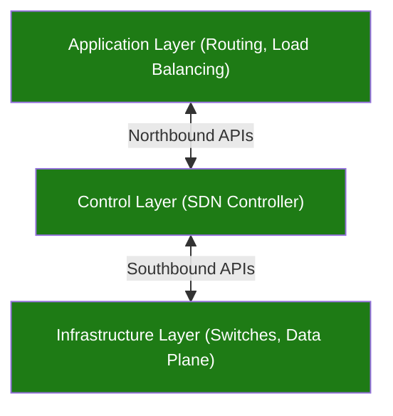

## Introducción

Hasta ahora veníamos hablando de infraestructura on premise, es decir, servidores físicos que nosotros teníamos que mantener. Vamos a ver como armar nuestra red en la nube para desligarnos de tener que mantenerlo nosotros.

La nube empezó en 1999, cuando Salesforce introdujo el concepto de entregar aplicaciones empresariales a través de una página web (SaaS). Luego, en 2006, Amazon lanzó S3 (Simple Storage Service) y EC2 (Elastic Compute Cloud), inaugurando la era moderna de la infraestructura en la nube. En 2008, Google entra al juego ofreciendo una plataforma para que los desarrolladores alojen aplicaciones web llamada App Engine, lo que luego evolucionaría a Google Cloud Platform (GCP). Posteriormente, en 2010, Microsoft lanza oficialmente Azure (originalmente llamado "Windows Azure") para competir directamente con AWS en el mercado empresarial. 

El consumo más alto de los datacenters físicos es la refrigeración, ya que el conjunto de procesadores en funcionamiento levantan altas temperaturas. Los racks instalados no son los convencionales que estuvimos viendo hasta ahora, sino que son especiales para tolerar este calor y además brindar cierta facilidad en la conectividad y el uso de espacio.

Las tres principales "nubes públicas son":
- AWS
- Azure
- Google Cloud

---
## Zonas de Disponibilidad

Las **zonas de disponibilidad** constituyen particiones lógicas y físicas dentro de la infraestructura de los datacenters virtuales diseñadas para garantizar alta disponibilidad y tolerancia a fallos. Cada una de estas zonas opera como un dominio de fallo completamente independiente, lo que previene que un incidente en una de ellas afecte a las demás. Físicamente, una zona de disponibilidad puede estar compuesta por uno o más datacenters discretos que albergan millones de servidores a gran escala. Un ejemplo claro de esta convención se observa en regiones de proveedores cloud como us-east-1, donde se subdividen en zonas como us-east-1a o us-east-1b.

La separación geográfica y el diseño eléctrico son factores críticos para asegurar la resiliencia sin degradar el rendimiento del sistema. Para evitar que un evento ambiental o físico simultáneo comprometa a varias zonas, se establece una distancia física deliberada, manteniendo una separación máxima de 100 kilómetros entre ellas. A nivel de suministro, cada zona cuenta con alimentación eléctrica independiente, lo que protege las cargas de trabajo ante apagones locales o fluctuaciones en la red energética de otra zona vecina.

A pesar de encontrarse físicamente separadas, las zonas de disponibilidad mantienen una interconexión de red de alta eficiencia que permite tratarlas casi como un único entorno coordinado. Esta conectividad se implementa mediante enlaces de fibra óptica dedicados y redundantes. Las características operativas clave de esta red entre zonas incluyen:
- Conexiones de fibra óptica dedicada con rutas redundantes para evitar cortes en el enlace.
- Capacidad de tráfico masivo mediante un amplio ancho de banda.
- Tiempos de respuesta mínimos gracias a una latencia extremadamente baja que posibilita la replicación síncrona.

---
## Virtual Private Cloud (VPC)

Las **Virtual Private Cloud (VPCs)** son construcciones de red definidas por software (SDN) y permiten la implementación de recursos de las IaaS. No tienen rangos de direcciones IP, son regionales o globales y contienen subredes. Podríamos decir que es una "parte de la nube" lógicamente segregada, que la empresa le otorga a los clientes para lanzar recursos en una red virtual.

Como dijimos, las plataformas cloud implementan **Software Defined Networking (SDN)** para desacoplar el control lógico de la red del hardware encargado de reenviar los paquetes. Este modelo organiza la conectividad en una arquitectura modular de tres capas superpuestas, permitiendo programar, automatizar y gestionar el comportamiento de la infraestructura de forma centralizada y dinámica sin intervenir directamente en los conmutadores físicos. La estructura divide las responsabilidades a través de interfaces estandarizadas entre sus niveles:

- **Capa de aplicación**: aloja los servicios y políticas de red superiores, tales como enrutamiento y balanceo de carga.
	- Interfaz Northbound APIs: comunica las aplicaciones y servicios con el controlador central.
- **Capa de control**: compuesta por el SDN Controller, actúa como el cerebro que toma las decisiones de tráfico y traduce las políticas.
	- Interfaz Southbound APIs: transmite las instrucciones y reglas de reenvío desde el controlador hacia el hardware físico.
- **Capa de infraestructura**: conforma el plano de datos, integrado por conmutadores físicos encargados de mover el tráfico real según las directivas recibidas.

En definitiva, podríamos decir que una red de VPC es una versión virtual de una red física y es un recurso global o regional dependiendo la nube
![[Pasted image 20261005111947.png|center|647]]

El plano de control y conectividad dentro de este esquema integra mecanismos de comunicación interna junto con puntos de acceso hacia el exterior. El enrutamiento propio de la VPC intercomunica de forma nativa las subredes situadas en distintas regiones sin requerir enlaces físicos dedicados gestionados por el usuario. A su vez, el tráfico hacia entornos externos se organiza a través de puntos de enlace especializados.

En el ecosistema de **Amazon Web Services (AWS)**, el alcance de la VPC difiere estructuralmente del enfoque global visto anteriormente, ya que la VPC es un recurso estrictamente regional y está asociado a una cuenta específica de AWS.
![[Pasted image 20261005112329.png|center|585]]

La segmentación interna y el aislamiento en AWS se resuelven asignando **subredes** dentro de cada zona de disponibilidad. A diferencia de la red contenedora que cubre toda la región, cada subred individual queda confinada a una zona específica. Estas subredes se categorizan según sus políticas de exposición:   
- **Subredes públicas**: configuradas con salida y enrutamiento hacia Internet para servicios expuestos al tráfico externo.
- **Subredes privadas**: aisladas del acceso público directo, reservadas para componentes internos como bases de datos o lógica de negocio. 

Por otro lado, plataformas como Google Cloud manejan un comportamiento distinto donde las subredes son componentes regionales y no se atan rígidamente a una única zona física. En el esquema que vimos previo al de AWS, una subred definida dentro de una región determinada puede extenderse y alojar máquinas virtuales en diferentes zonas de disponibilidad que compartan esa misma región geográfica, manteniendo la misma configuración de direccionamiento IP y comunicándose mediante el enrutador virtual de la red.

Entonces, una VPC está compuesta por subredes, que se deben configurar con un rango de direcciones IP privadas que se usan para la comunicación de red interna. Como sabemos, en las [[06. Capa de Red#Direccionamiento IPv4|direcciones IP]] cada octeto está representado por 8 bits. El valor `/##` determina la cantidad de bits estáticos de la dirección.
![[Pasted image 20261005113139.png|center|357]]

La definición del espacio de direccionamiento de una VPC se establece mediante la asignación de una lista de bloques bajo la notación [[06. Capa de Red#Superredes|CIDR]], tomando como referencia rangos privados como por ejemplo `172.16.0.0/12`. A partir de este espacio general, la red virtual se subdivide internamente en múltiples subredes para distribuir las direcciones utilizables entre los recursos que se vayan a desplegar.

El tamaño de estos bloques de red está delimitado por restricciones técnicas que fijan tanto una capacidad mínima como una máxima dentro de la infraestructura:
- Bloque mínimo con máscara `/28`, lo que equivale a un total de 16 direcciones IP.
- Bloque máximo con máscara `/16`, que permite abarcar un espacio de hasta 65536 direcciones IP.

Las instancias desplegadas bajo el modelo de infraestructura como servicio dentro de una VPC reciben de manera obligatoria una dirección IP privada perteneciente al rango de la subred donde residen, complementándose opcionalmente con una IP pública según los requerimientos de conectividad exterior. En cuanto a la estructura de red inicial, el bloque CIDR configurado originalmente al crear la VPC no se puede modificar una vez establecido, por lo que cualquier necesidad de crecimiento debe resolverse agregando nuevos bloques CIDR secundarios para expandir el espacio de direcciones disponible.

Al planificar la asignación de estos rangos de red, es crítico considerar la interoperabilidad futura y evitar el solapamiento de direcciones con otras redes con las cuales se tenga previsto establecer interconexión, ya sea mediante peering, túneles VPN o enlaces a centros de datos locales. La superposición de bloques CIDR genera conflictos de enrutamiento que impiden la comunicación directa entre entornos conectados.

Como vimos, el rango de CIDR determina cuántas direcciones IP están disponibles. Al agregar el número 1 a `/##`, se reducirán las direcciones IP disponibles a la mitad:
- `/16`: 65.536
- `/17`: 32.786
- `/18`: 16.384
- `/19`: 8.192
- `/20`: 4.096
- `/21`: 2.048
- `/22`: 1.024
- `/23`: 512
- `/24`: 256
- `/25`: 128
- `/26`: 64
- `/27`: 32
- `/28`: 16

Debemos tener en cuenta los aspectos básicos de las direcciones IP públicas y privadas:
- **IP Privada**: Se asigna del rango de subred a las VM mediante DHCP, y se renueva cada 24 horas. El nombre de la VM y la IP se registran con un DNS acotado a la red.
- **IP Pública**: Se puede asignar desde un grupo (efímera) o se puede reservar (estática). Se factura cuando no está vinculada a una VM en ejecución. La VM no conoce la IP externa; está asignada a la IP interna.

---
## Principales Elementos

Los principales elementos de red de todas las Nubes son:
- **Nube Virtual Privada (VPC)**: Administración de herramientas de redes para recursos.
- **Balanceador de Cargas de Cloud**: Ajuste de escala automático y balanceo de cargas en todo el mundo. Toma decisiones en la distribución de las cargas.
- **Cloud CDN**: Red de distribución de contenidos.
- **Cloud Intercloud**: Interconexión rápida y de alta disponibilidad. Permite tener un caché de contenido cercano al usuario final, para reducir la latencia. Se debe tener un link 
- **Cloud DNS**: Red de DNS global con alta disponibilidad.

![[Pasted image 20261005114352.png|center|554]]

---
## Enrutamiento

Las **rutas** en una red virtual definen el camino que debe seguir el tráfico emitido desde una máquina virtual hacia cualquier otro destino, vinculando un rango de direcciones IP de destino con un salto o recurso específico. Toda red incorpora automáticamente rutas internas para que las instancias puedan enviarse paquetes directamente entre sí sin intermediarios externos, así como una ruta predeterminada configurada hacia el destino `0.0.0.0/0` para canalizar todo el tráfico cuyo destino quede fuera de la red local, comúnmente hacia una puerta de enlace de Internet. Sin embargo, la sola existencia de una ruta válida no garantiza la conectividad, ya que las reglas de firewall correspondientes deben autorizar explícitamente el paso del paquete para que este alcance su destino.

En un esquema de enrutamiento basado en software como el de Google Cloud, las **tablas de enrutamiento** se aplican directamente a las interfaces de las máquinas virtuales, resolviendo los saltos de forma distribuida.
![[Pasted image 20261005114601.png|center|428]]

Cada entidad conectada, ya sea una instancia de cómputo o una puerta de enlace, evalúa sus entradas locales para determinar hacia dónde despachar cada paquete según su dirección de destino. De esta forma, el tráfico se segmenta y despacha de acuerdo con las necesidades de la infraestructura:
- Hacia subredes locales o remotas dentro de la misma VPC mediante saltos directos de red virtual, como por ejemplo hacia los rangos `192.168.5.0/24` o `10.128.1.0/20`.
- Hacia el exterior público vía la ruta predeterminada `0.0.0.0/0` apuntando a la puerta de enlace de Internet.
- Hacia entornos on-premise u otras redes corporativas mediante una puerta de enlace de VPN, como ocurre con el rango de destino `172.12.0.0/16`.

![[Pasted image 20261005114745.png|center|549]]

La gestión y control de estos flujos se administra a través del **panel de rutas de la red**, donde se listan de manera detallada los destinos, las prioridades y el tipo de salto siguiente asignado a cada entrada. La prioridad define qué ruta prevalece cuando existen múltiples coincidencias para un mismo prefijo, mientras que el campo de próximo salto especifica el mecanismo de entrega, distinguiendo entre el propio tejido virtual de la red y las distintas puertas de enlace configuradas.
![[Pasted image 20261005114813.png|center|446]]

Las rutas dentro de una red virtual se clasifican en dos grandes categorías según su origen, abarcando cuatro tipos operativos específicos. Esta clasificación divide los cuatro tipos de rutas disponibles de la siguiente forma:
- **Rutas Generadas por el Sistema**: la plataforma las crea de forma automática para garantizar el funcionamiento base del entorno.
	- **Ruta predeterminada**: creada por el sistema para canalizar el tráfico general no emparejado hacia el exterior.
	- **Ruta de subred**: generada automáticamente para permitir la comunicación directa entre las instancias de las subredes locales.
- **Rutas Personalizadas**: son definidas manual o programáticamente para conectar topologías complejas o redes externas.
	- **Ruta estática**: personalizada e ingresada manualmente por el administrador para fijar destinos y saltos fijos.
	- **Ruta dinámica**: personalizada pero aprendida y actualizada automáticamente mediante protocolos de enrutamiento como BGP a través de puertas de enlace.
	    
Al momento de reenviar un paquete, el motor de red aplica un orden estricto de evaluación secuencial para determinar qué entrada debe utilizarse:
1. Primero, se consideran las rutas de las subredes.
2. Luego, busca otra ruta con el destino más específico.
3. Si más de una ruta tiene el mismo destino más específico, se considera la prioridad de la ruta.
4. Si no se encuentra un destino aplicable, descarta el paquete.

---
## Web Application Firewall (WAF)

Un WAF está diseñado específicamente para frenar ataques dirigidos a vulnerabilidades de las aplicaciones web, tales como:
- **SQL Injection (SQLi)**: Cuando un atacante intenta inyectar comandos de bases de datos maliciosos a través de campos de texto (como un cuadro de usuario o contraseña) para robar información.
- **Cross-Site Scripting (XSS)**: Cuando un atacante logra inyectar scripts maliciosos en páginas web vistas por otros usuarios.
- **Ataques de denegación de servicio a nivel de aplicación (DDoS en capa 7)**: Intentos de colapsar la aplicación enviando solicitudes HTTP masivas y legítimas en apariencia.
- **Inclusión de archivos o ataques de bots maliciosos**: Intentos automatizados de raspar contenido, adivinar contraseñas mediante fuerza bruta (credential stuffing) o explotar fallos conocidos.

El **firewall** de una VPC opera bajo una arquitectura distribuida, protegiendo a las instancias de máquinas virtuales contra accesos y conexiones no autorizadas. Aunque las reglas se definen y aplican globalmente a nivel de toda la red virtual, el filtrado efectivo ocurre en la interfaz de cada instancia, donde el tráfico se permite o rechaza de manera individual. 

Este mecanismo maneja estado, lo que implica que al autorizarse un flujo saliente o entrante, las respuestas correspondientes se permiten de forma automática sin requerir una regla inversa. Por defecto, el sistema implementa reglas implícitas que bloquean todas las conexiones entrantes y permiten la totalidad de las salientes.

Para controlar el tráfico de forma granular, el administrador define conjuntos de reglas estructuradas mediante atributos específicos:
- Dirección: especifica si la regla evalúa tráfico de entrada hacia la instancia o de salida desde ella.
- Origen o destino: delimita las direcciones IP o rangos de red que inician o reciben la comunicación.
- Protocolo y puerto: determina el estándar de transporte y el servicio puntual al que aplica el control.
- Acción: establece si los paquetes emparejados deben ser permitidos o denegados.
- Prioridad: define el orden numérico de evaluación entre reglas para resolver posibles coincidencias o conflictos.
- Asignación: indica a qué instancias específicas dentro de la red se vincula la regla mediante etiquetas u otros criterios.

El control de tráfico saliente en el firewall distribuido de Google Cloud permite regular los paquetes emitidos desde una máquina virtual hacia otros destinos, ya sean hosts externos en Internet u otras instancias dentro de la misma red virtual. La evaluación se fundamenta en condiciones tales como los rangos de bloques CIDR de destino, los protocolos de red utilizados y los puertos de destino requeridos. En base a la coincidencia con estas condiciones, la regla ejecuta una acción determinante: permitir la conexión de salida si se ajusta a las políticas aprobadas, o rechazarla y bloquear el paquete en caso contrario.
![[Pasted image 20261005115631.png|center|521]]

De manera análoga, el caso de uso para tráfico entrante inspecciona las conexiones dirigidas hacia las instancias desde el exterior o desde recursos pares internos. La lógica de filtrado evalúa los siguientes parámetros antes de autorizar el ingreso al recurso protegido:
![[Pasted image 20261005115541.png|center|489]]
Entre los distintos proveedores tenemos las siguientes alternativas:

|                 Criterio                  |                                                                                                 AWS WAF                                                                                                  |                                                      Azure WAF (Azure Front Door / App Gateway)                                                       |                                                                     Google Cloud Armor                                                                     |
| :---------------------------------------: | :------------------------------------------------------------------------------------------------------------------------------------------------------------------------------------------------------: | :---------------------------------------------------------------------------------------------------------------------------------------------------: | :--------------------------------------------------------------------------------------------------------------------------------------------------------: |
|          **Nombre del Servicio**          |                                                                                                 AWS WAF                                                                                                  |                                            Azure WAF (integrado en Azure Front Door y Application Gateway)                                            |                                                                     Google Cloud Armor                                                                     |
|      **Arquitectura e Integración**       |                                            Se asocia directamente a componentes como Amazon CloudFront (CDN), Application Load Balancer (ALB) y API Gateway.                                             |                    Viene integrado nativamente en Azure Front Door (nivel global/edge) y en Application Gateway (nivel regional).                     |            Se integra de forma directa con el Google Front End (GFE) y el balanceador de cargas global de Google Cloud (Cloud Load Balancing).             |
|        **Protección contra DDoS**         |                                               Se combina con AWS Shield (Estándar de forma gratuita y Advanced para protección de capa 3, 4 y 7 avanzada).                                               |                                  Azure DDoS Protection (integrado con los servicios de red y escalado en el borde).                                   |               Google Cloud Armor incluye protección contra ataques DDoS volumétricos y de capa de aplicación de forma nativa desde su base.                |
|    **Reglas y Mitigación de Amenazas**    | • Soporta reglas personalizadas. • Reglas administradas por AWS y terceros (Marketplace) orientadas al OWASP Top 10. • Capacidades de inspección de cuerpos de peticiones y límites configurables. | • Front Door Standard: solo reglas personalizadas. • Front Door Premium: incluye reglas administradas de OWASP y protección contra bots integrada. | • Reglas preconfiguradas de defensa contra OWASP Top 10. • Políticas de seguridad adaptadas mediante expresiones regulares y lógica avanzada de Google. |
| **Gestión de Bots y Mitigación Avanzada** |                                                Cuenta con el complemento AWS Bot Control (con costo de suscripción mensual y por millón de solicitudes).                                                 |                                 Azure Bot Protection está integrado nativamente dentro del nivel Front Door Premium.                                  |                        Ofrece defensas avanzadas contra bots y análisis adaptativo de amenazas basado en la inteligencia de Google.                        |

---
## Intercambio de Tráfico

Las **redes compartidas** permiten que varios proyectos independientes se conecten a una única red de VPC centralizada y común, facilitando que servicios desacoplados en proyectos distintos, como recomendación, personalización o analítica, interactúen de forma segura con un servidor central de aplicaciones web mientras mantienen sus respectivos almacenes de datos aislados.
![[Pasted image 20261005120322.png|center|563]]

Cuando las cargas de trabajo pertenecen a entidades administrativas completamente separadas, como ocurre en la relación entre un consumidor y un proveedor de software como servicio, se recurre al **intercambio de tráfico entre VPCs**. Este mecanismo habilita la conectividad bidireccional mediante direcciones IP privadas bajo el estándar RFC 1918 entre dos redes independientes, sin exponer los paquetes a la Internet pública ni requerir pasarelas intermedias complejas. Cada parte conserva sus propios roles de administración tanto a nivel de red como de instancias de cómputo, preservando la autonomía y la separación de permisos de cada organización.
![[Pasted image 20261005120409.png|center|559]]

Para implementar correctamente este esquema de interconexión directa entre VPCs, es fundamental considerar una serie de pautas y restricciones técnicas de diseño:
- Opera directamente con entornos flexibles de infraestructura como servicio, careciendo de sentido para la conexión con servicios públicos externos.
- La administración de cada red participante permanece totalmente separada e independiente.
- La asociación debe configurarse de manera explícita e independiente en cada uno de los dos extremos del enlace.
- No se permite la superposición ni el solapamiento de rangos de direcciones IP en las subredes de las redes interconectadas.

Podemos sintetizar las diferencias entre la VPC compartida y el intercambio de tráfico entre VPC:

|      Consideración      | VPC compartida | Intercambio de tráfico entre redes de VPC |
| :---------------------: | :------------: | :---------------------------------------: |
|  Entre organizaciones   |       No       |                    Sí                     |
|     En el proyecto      |       No       |                    Sí                     |
| Administración de redes |  Centralizada  |              Descentralizada              |

---
## Cloud VPN

**Cloud VPN** es un servicio gestionado que conecta de forma segura y cifrada una red local o centro de datos con una red de VPC en Google Cloud atravesando la Internet pública. Está concebido principalmente para flujos de datos de bajo o moderado volumen, garantizando un acuerdo de nivel de servicio del 99.9% de disponibilidad. Entre sus capacidades técnicas se destacan las siguientes:
- Soporte para conexiones de tipo sitio a sitio entre las puertas de enlace corporativas y la nube.
- Compatibilidad con esquemas de enrutamiento tanto estático como dinámico mediante Cloud Router.
- Negociación y seguridad mediante protocolos criptográficos basados en IKEv1 e IKEv2.

En una **topología de VPN estática**, el túnel cifra la comunicación entre la IP externa regional asignada a la puerta de enlace de Cloud VPN en la nube y la IP externa del dispositivo de VPN local. El tráfico interno se distribuye mediante tablas de enrutamiento fijas configuradas manualmente hacia los distintos recursos en regiones como us-west1 y us-east1, así como hacia las subredes locales que van de `10.0.1.0/24` a `10.0.30.0/24`. Un parámetro operativo crítico en el siguiente esquema es la limitación del tamaño máximo de paquete de transmisión, fijado en un MTU máximo de 1460 bytes para contemplar la sobrecarga que añade el encabezado del encapsulamiento IPsec.
![[Pasted image 20261005121137.png|center|626]]

Por otro lado, la **topología de enrutamiento dinámico** introduce el componente Cloud Router para automatizar el aprendizaje e intercambio de topologías de red sin intervención estática. El túnel VPN dinámico establece una sesión BGP entre la interfaz de Cloud Router y la puerta de enlace remota, empleando direcciones IP de vínculo local pertenecientes al rango `169.254.0.0/16` para el diálogo entre pares. Esta integración permite propagar dinámicamente los cambios en subredes de prueba, producción o staging hacia los distintos racks de la red externa con reinicio ordenado, adaptando automáticamente las rutas ante caídas o expansiones de la infraestructura.
![[Pasted image 20261005121254.png|center|618]]

---
## Cloud Interconnect

**Cloud Interconnect** constituye una solución de conectividad empresarial diseñada para extender redes locales hacia una VPC de Google Cloud mediante enlaces directos de alta capacidad, superando las limitaciones de ancho de banda e inestabilidad propias de los túneles IPsec sobre la Internet pública. Este servicio se estructura en dos modalidades operativas según el nivel de acceso a las instalaciones físicas de interconexión.

La primera se conoce como **interconexión dedicada**. Se establece una conexión física directa entre la red del cliente y la red de Google en una instalación de colocación o coubicación conjunta.
![[Pasted image 20261005121550.png|center|596]]

En esta modalidad, la infraestructura física se conecta directamente dentro de una instalación compartida sin proveedores intermedios de tránsito. El router del cliente en dicho centro de coubicación se enlaza físicamente mediante un cable cruzado con el perímetro de intercambio de tráfico de Google. A nivel de red, el enrutamiento dinámico se coordina a través de Cloud Router, el cual negocia una sesión BGP con el router local utilizando direcciones de enlace local del bloque `169.254.0.0/16`, habilitando la comunicación bidireccional entre las instancias de cómputo en la nube y los usuarios o servidores on-premise.
![[Pasted image 20261005121701.png|center|671]]

La segunda modalidad se denomina **interconexión de socio**. Se proporciona conectividad a la VPC a través de un proveedor de servicios externo compatible cuando el cliente no se encuentra físicamente en el mismo punto de presencia que Google.
![[Pasted image 20261005121736.png|center|614]]

La interconexión de socio introduce una capa de transporte gestionada por un operador intermediario. En este diseño, el perímetro de red de Google se conecta con el equipamiento del proveedor dentro de la instalación de colocación, y dicho proveedor se encarga de extender la conexión hasta la red del cliente. Pese a contar con este salto intermedio en la infraestructura física, el plano lógico preserva el uso de Cloud Router para establecer la sesión BGP de extremo a extremo entre la VPC y el router local, asegurando la propagación dinámica de las rutas de subred privadas hacia la sede o centro de datos externo.
![[Pasted image 20261005121800.png|center|656]]

Podemos establecer la siguiente comparación entre las opciones de interconexión:

|        Conexión        |                                       Proporciona                                       |                           Capacidad                            |                Requisitos                 |     Tipo de acceso      |
| :--------------------: | :-------------------------------------------------------------------------------------: | :------------------------------------------------------------: | :---------------------------------------: | :---------------------: |
|   Túneles VPN IPsec    |           Túnel encriptado para redes de VPC a través de la Internet pública            |              Entre 1.5 Gbps y 3.0 Gbps por túnel               |       Puerta de enlace de VPN local       | Direcciones IP internas |
| Interconexión dedicada |                       Conexión dedicada y directa a redes de VPC                        | 8 circuitos de 10 Gbps 2 circuitos de 100 Gbps por conexión | Conexión en una instalación de colocación | Direcciones IP internas |
| Interconexión de socio | Ancho de banda dedicado, conexión a la red de VPC a través de un proveedor de servicios |              Entre 50 Mbps y 10 Gbps por conexión              |          Proveedor de servicios           | Direcciones IP internas |

---
## Balanceo de Cargas

El **balanceo de cargas** permite distribuir las solicitudes de los usuarios entre conjuntos de instancias de cómputo para optimizar la disponibilidad y el rendimiento. Según su alcance geográfico y el tipo de tráfico, estos servicios se clasifican en dos grandes familias:
![[Pasted image 20261005122141.png|center|591]]

El **balanceador global HTTP(S)** procesa las conexiones a través de un flujo estructurado por etapas lógicas. ![[Pasted image 20261005122237.png|center|618]]
El paquete ingresa desde Internet hacia una IP global externa gestionada por una regla de reenvío global, la cual analiza la dirección, el protocolo y el puerto de entrada. Esta regla delega la solicitud a un proxy de destino asistido por un mapa de URL, el cual inspecciona el contenido de la petición para asociarla a un servicio de backend específico. Dicho servicio evalúa la capacidad de entrega de cada zona, el estado operativo reportado por las verificaciones de estado continuas y las reglas de firewall vigentes antes de despachar el paquete al grupo de instancias administradas correspondiente.

En los esquemas con terminación por **proxy SSL**, la conexión TCP segura proveniente de usuarios en ubicaciones dispersas finaliza directamente en la IP pública del balanceador en el puerto `443`, desacoplando el cifrado externo del procesamiento interno. 
![[Pasted image 20261005122401.png|center]]
A partir de allí, el balanceador abre sesiones independientes hacia los grupos de instancias en regiones como us-central1 o us-east1, permitiendo de manera opcional volver a cifrar el tráfico interno con SSL según las políticas de seguridad. Por su parte, el balanceador de red regional opera de forma directa sin proxies intermedios ni IPs globales, despachando el tráfico hacia un grupo de destino que puede apoyarse en un grupo alternativo por conmutación de error, integrando escalado automático y plantillas de instancias para responder ante aumentos de demanda o fallas de salud.
![[Pasted image 20261005122712.png|center|517]]

En **arquitecturas multicapa completas**, estos mecanismos suelen combinarse de manera escalonada para aislar la exposición pública. 
![[Pasted image 20261005122601.png|center]]
Los clientes externos interactúan inicialmente con un balanceador global HTTP(S) accesible mediante una dirección IP pública compartida, el cual reparte las peticiones entre los servidores del nivel web desplegados en diferentes zonas y regiones. Detrás de esta capa frontal, las solicitudes hacia los componentes de procesamiento interno y las bases de datos no se exponen al exterior; son gestionadas localmente por balanceadores de carga internos que operan bajo direcciones IP privadas y puertos restringidos dentro de cada zona, garantizando un flujo eficiente y seguro entre capas de aplicación.

---
## DNS

Un **servicio de DNS** en la nube es un sistema de [[03. DNS y Mail#Resolución de Nombres|nombres de dominio (DNS)]] gestionado y distribuido globalmente por un proveedor cloud. Su función es traducir nombres de dominio (como por ejemplo `sitio.com`) a direcciones IP de forma altamente escalable, rápida (usando la red global del proveedor) y con alta disponibilidad, sin que el usuario tenga que gestionar la infraestructura de servidores.

Estos servicios incluyen algunas funcionalidades avanzadas como:
- DNS Geográfico (GeoDNS): Enruta el tráfico a diferentes IP basándose en la ubicación geográfica del usuario.
- DNS Privado: Permite la resolución de nombres dentro de redes virtuales privadas (VPC) o redes híbridas.
- Integración con otros servicios en la nube: Facilita el enrutamiento del tráfico a recursos de la nube como balanceadores de carga o instancias.

Repasando algunos registros clave de DNS:

| Tipo de Registro | Nombre Completo    | Ejemplo de Uso                                       |
| ---------------- | ------------------ | ---------------------------------------------------- |
| `A`              | Address Record     | `tusitio.com` → `192.0.2.1`                          |
| `AAAA`           | IPv6 Address       | `tusitio.com` → `2001:db8::1`                        |
| `CNAME`          | Canonical Name     | `www.tusitio.com` → `tusitio.com`                    |
| `MX`             | Mail Exchange      | `tusitio.com` → `mail.tusitio.com` (Prioridad 10)    |
| `TXT`            | Text Record        | `"v=spf1 include:_spf.google.com ~all"`              |
| `NS`             | Name Server        | `ns1.tusproveedor.com`                               |
| `PTR`            | Pointer Record     | `192.0.2.1` → `tusitio.com`                          |
| `SOA`            | Start of Authority | Configurado automáticamente por tu proveedor de DNS. |
| `SRV`            | Service Locator    | Localizar servidores de chat o SIP.                  |

Una **Hosted Zone** en los servicios cloud de DNS actúa fundamentalmente como un contenedor lógico para alojar y organizar conjuntos de registros DNS. Por convención y diseño, adopta exactamente la misma denominación que el nombre de dominio correspondiente que administra, como por ejemplo `itba.edu.ar`. Este componente permite centralizar la definición de enrutamiento y traducción de nombres hacia los recursos asociados a la infraestructura.

Según el ámbito de alcance y la visibilidad de los nombres que gestionan, estas zonas se dividen en dos tipos operativos:
- **Public Hosted Zones**: orientadas a la resolución de nombres de dominio accesibles públicamente desde cualquier cliente en Internet.
- **Private Hosted Zones**: configuradas exclusivamente para resolver nombres internos dentro del límite privado de una red de VPC.

Para el caso específico de las zonas privadas, el acceso a las respuestas de los registros está restringido al entorno interno de la red asociada. Con el fin de obtener una resolución exitosa de los nombres configurados en una Private Hosted Zone, la consulta DNS debe originarse de forma estricta desde un recurso interno, como una instancia de cómputo EC2 que resida dentro de esa VPC específica.

---
## Almacenamiento

El **almacenamiento** en la nube representa la capa de persistencia fundamental dentro de los centros de datos virtuales, desacoplando los datos del hardware físico local mediante infraestructura gestionada por software. Existen distintos **[[04. Almacenamiento#Tipos de Almacenamiento|tipos de almacentamiento]]** según el tipo de carga de trabajo y el mecanismo de interacción con las instancias de cómputo. En AWS, la clasificación principal divide la oferta en tres paradigmas fundamentales:
![[Pasted image 20261005131320.png|center|608]]
- **Almacenamiento de archivos**: ofrece un sistema de ficheros jerárquico y compartido accesible de forma concurrente por múltiples instancias mediante protocolos de red.
	- **[[04. Almacenamiento#Elastic File System|Elastic File System (EFS)]]**: es un network file system as-a-service escalable, elástico, de alta disponibilidad y compatible con protocolo NFS. Caso de Uso: montar un volumen compartido entre múltiples instancias EC2.
- **Almacenamiento en bloques**: provee volúmenes de bajo nivel que actúan como discos duros montados directamente en el sistema operativo de las instancias.
	- **[[04. Almacenamiento#Elastic Block Storage|Elastic Block Storage (EBS)]]**: es un network-attached-storage (NAS) basado en discos virtuales con diferentes tipos disponibles (HDD, General Purpose SSD, Provisioned IOPS SSD). Caso de Uso: disco dedicado a una instancia EC2).
	- **EC2 Instance Store**: consiste en el disco raíz (`/`) de una instancia EC2 attacheado físicamente al host que la aloja. Dependiendo del tipo de instancia, algunas vienen con SSD. Se borran al reiniciar la instancia. Caso de Uso: datos temporales, cache, etc.
- **Almacenamiento de objetos**: gestiona datos no estructurados junto con metadatos asociados mediante un espacio plano, ideal para distribución web, escalabilidad masiva y preservación a largo plazo.
	- **[[04. Almacenamiento#Simple Storage Service (S3)|Amazon S3]]**: consiste en almacenamiento de archivos en la nube AWS de alta disponibilidad (99.5-99.99%), redundante (durabilidad de 11 9's) y que ofrece diferentes tiers. Pueden definirse políticas de ciclo de vida para mover archivos automáticamente entre tiers.
		- Express One Zone: mejor latencia.
		- Standard: datos activos, acceso frecuente.
		- Infrequent Access: menor precio, mayor tiempo de acceso.
		- One Zone Infrequent Access: más barato.
	- **[[04. Almacenamiento#Simple Storage Service (S3)|Amazon Glacier]]**: consiste en almacenamiento barato a largo plazo, pero el acceso no es inmediato, ya que leer los archivos requiere un proceso de desarchivado. Es pago por cada acceso, y por ende muy útil para archivos de acceso muy poco frecuente. Ejemplo: histórico de transacciones.

Google Cloud Storage también organiza el almacenamiento de objetos en distintos niveles o tiers en función del patrón de uso, el costo y la inmediatez requerida para la recuperación de los datos. A pesar de las diferencias en durabilidad geográfica o latencia de coste entre cada modalidad, la totalidad de los niveles se gestiona de manera uniforme a través de una única API consistente, simplificando la integración y el ciclo de vida de los objetos.

Estos niveles se dividen en dos grandes grupos según su propósito operativo:
![[Pasted image 20261005132909.png|center|550]]
- **Alta disponibilidad y acceso frecuente**: comprende multi-regional, orientado a cargas críticas mediante almacenamiento con redundancia geográfica distribuida, y Regional, enfocado en maximizar el rendimiento al ubicar los datos junto al acceso local de los recursos de cómputo.
- **Copias de seguridad y archivo**: abarca Nearline, diseñado para datos a los que se accede menos de una vez al mes bajo un esquema de baja frecuencia, y Coldline, reservado para acceso de menor frecuencia orientado a información consultada menos de una vez al año.

---
## Cloud Billing

La **facturación en la nube (cloud billing)** es el sistema que utilizan los proveedores tecnológicos para medir, calcular y cobrar de forma automatizada por los recursos informáticos consumidos. A diferencia de los servidores físicos tradicionales (modelo de gasto de capital o CapEx), la nube funciona bajo un esquema de pago por uso (pay-as-you-go).

Para esto, se implementa:
- **Medición de uso (Metering)**: El sistema registra en tiempo real el consumo exacto de componentes como máquinas virtuales, almacenamiento, base de datos, red y solicitudes a APIs.
- **Procesamiento y tarifas**: Los datos de uso se multiplican por las listas de precios públicas o los contratos personalizados de la plataforma.
- **Ciclos de cobro y pagos**: Los cargos se acumulan de manera continua y se procesan de forma automática al final del periodo mediante tarjeta de crédito, débito o factura mensual según el acuerdo comercial.
- **Control y visibilidad**: Permiten monitorear gastos diarios, configurar alertas de presupuesto y exportar datos detallados de costos a herramientas analíticas.
- **Optimización y descuentos**: Ofrecen reducción de tarifas a cambio de compromisos de uso a largo plazo (por ejemplo, por uno o tres años) o mediante sugerencias generadas por inteligencia artificial.
- **Gestión de cuentas**: Se pueden vincular múltiples proyectos tecnológicos a una sola billetera central o utilizar subcuentas para separar gastos por departamentos o clientes.

---
## Site Reliability Engineering

**Site Reliability Engineering** surge como una disciplina formal originada en Google ante la necesidad crítica de operar sistemas masivos a escala, lo que exigió romper la barrera histórica existente entre los equipos de desarrollo de software y las áreas de operaciones tradicionales. 

Su concepción fundacional fue formulada por Ben Treynor Sloss al definir que SRE es el resultado directo de encargarle a un ingeniero de software que diseñe una función completa de operaciones. Este enfoque traslada la mentalidad, las metodologías y las herramientas del desarrollo de software hacia los desafíos operativos de disponibilidad y mantenimiento de la infraestructura, abordando la confiabilidad a través de ejes que contemplan los procesos, la tecnología, las personas y la cultura organizacional, además de marcos para el aprendizaje continuo.

La relación y distinción entre DevOps y Site Reliability Engineering suele sintetizarse bajo la analogía programática de que SRE implementa DevOps. Mientras DevOps se define como un conjunto amplio de pautas culturales orientadas a derribar los silos entre desarrollo, operaciones y arquitectura de TI, SRE toma ese núcleo conceptual y lo materializa mediante principios, prácticas y métricas concretas que determinan qué hacer y cómo actuar para maximizar la confiabilidad y la satisfacción del usuario final.

Las diferencias operativas se evidencian en los pilares fundamentales que promueve DevOps frente a su ejecución práctica en SRE:
- Reducir los silos organizacionales
- Aceptar el fracaso como algo normal
- Implementar cambios graduales
- Aprovechar las herramientas y la automatización
- Medir todo

La disciplina de Site Reliability Engineering organiza su marco de trabajo a través de tres componentes estructurales interconectados:
- **Procesos**: se contempla el alcance del equipo, la gestión de guardias y toil, la planificación de capacidad, la respuesta a incidentes y los post mortems.
- **Tecnología**: se contemplan los Service Level Indicators (SLIs), los Service Level Objectives (SLOs), los Error Budgets, el monitoreo y agregación y la observabilidad.
- **Gente y Cultura**: incluye la inculpabilidad, la seguridad psicológica, la aceptación del riesgo, la medición generalizada, la reducción de la ambigüedad, el cambio controlado y la sustentabilidad.

Dentro del componente de **procesos** en SRE, una de las metas operativas primordiales es equilibrar el tiempo dedicado al toil frente al trabajo de ingeniería de proyecto. El toil abarca las tareas manuales, operativas y repetitivas que carecen de valor duradero y crecen de forma lineal con el servicio. Para preservar la sustentabilidad del equipo, se define un tope estricto de hasta el 50% de la carga laboral para el trabajo puramente de proyecto, reservando una franja fija y un rango variable entre el 20% y el 50% para el toil en función de las prioridades del momento.
![[Pasted image 20261005212834.png|center|514]]

El valor de la automatización se ve reflejado en:
- Consistencia
- Una plataforma
- Soluciones más rápidas
- Acciones más rápidas
- Tiempo valioso que se gana

En el pilar de **tecnología** de Site Reliability Engineering, la medición de la confiabilidad evoluciona desde enfoques basados en tiempo hacia métricas centradas en el usuario. La hipótesis inicial plantea calcular la disponibilidad dividiendo el tiempo activo sobre el tiempo total de servicio.
$$\text{Disponibilidad} = \frac{\text{Tiempo Activo}}{\text{Tiempo Total}}$$
Si bien esto resulta sencillo para métricas binarias o para medir el tiempo encendido de una máquina física, falla en entornos distribuidos de tipo solicitud y respuesta, donde un nodo sin carga o la caída de uno entre varios servidores no indican necesariamente una interrupción del sistema. Por ello, se recurre a una fórmula más sofisticada que divide las interacciones exitosas sobre el total de interacciones, reflejando fielmente la fracción real de usuarios para quienes el servicio responde correctamente.
$$\text{Disponibilidad} = \frac{\text{Interacciones Exitosas}}{\text{Interacciones Totales}}$$

En este contexto, perseguir una disponibilidad del 100% constituye un objetivo erróneo para prácticamente cualquier sistema, ya que el costo y la sobreingeniería requeridos para eliminar cualquier fallo paralizan la innovación del producto. De este principio surge el presupuesto de error o Error Budget, establecido de manera conjunta entre Product Management y el equipo de SRE para fijar una meta de disponibilidad realista. El monitoreo mide el tiempo de actividad real y controla el consumo de dicho presupuesto, permitiendo asumir riesgos calculados y lanzar cambios mientras el saldo de error se mantenga dentro de los límites aprobados.

Para instrumentar técnicamente estos compromisos, la confiabilidad se estructura formalmente a través de tres niveles jerárquicos de evaluación y acuerdo:
- **Service Level Indicator (SLI)**: representa la métrica cuantitativa y precisa que define si un evento fue suficientemente exitoso, evaluando si el valor medido se mantiene por debajo de un umbral específico.
- **Service Level Objective (SLO)**: constituye el objetivo interno prioritario fijado como una meta de cumplimiento para el indicador, estructurado típicamente como el cociente de la suma de indicadores cumplidos sobre la ventana total.
- **Service Level Agreement (SLA)**: formaliza el compromiso contractual externo, incorporando el objetivo interno más un margen de tolerancia y las consecuencias financieras o legales derivadas de su incumplimiento.

La selección de un objetivo de nivel de servicio apropiado resulta un proceso complejo que debe mantenerse simple y evitar valores absolutos. El propósito operativo consiste en superar el objetivo fijado pero sin excederlo de forma desmedida, ya que una sobreentrega acostumbra a los usuarios a una estabilidad artificialmente alta y eleva los costos innecesariamente.

El pilar de **personas y cultura** en SRE sostiene que la confiabilidad técnica no puede alcanzarse sin empoderar a los empleados mediante un entorno de trabajo saludable y colaborativo. Este empoderamiento se fundamenta en tres principios rectores: la seguridad psicológica, la inculpabilidad y la transparencia en la comunicación.

El impacto de este entorno se refleja en la dinámica de trabajo de los equipos y en su capacidad para afrontar incidentes de manera abierta:
- Equipos no seguros: las reuniones se perciben como hostiles para compartir dudas, imperando tonos condescendientes o agresivos que llevan a ocultar errores por miedo a represalias.
- Equipos seguros: prevalece la confianza mutua, y las respuestas ante situaciones imprevistas o equivocaciones se orientan de forma constructiva bajo la convicción de tener la libertad de expresar lo necesario.

Esta cultura se refuerza mediante un ciclo virtuoso continuo entre la inculpabilidad y la elaboración de post mortems tras un incidente. Al analizar un fallo en producción, el enfoque se centra en comprender qué deficiencias en el sistema o en los procesos posibilitaron el evento, en lugar de señalar o penalizar a las personas involucradas.
![[Pasted image 20261006000037.png|center|397]]

---
## Logs y Monitoreo

La ingestión y procesamiento de **registros** en Google Cloud se canaliza de forma automatizada mediante una arquitectura centralizada que recopila eventos de múltiples fuentes, tales como auditoría, servicios internos, aplicaciones, syslog y plataforma. No es necesario configurar manualmente los registros de auditoría ni los generados por los servicios nativos de la nube, ya que la plataforma los absorbe directamente a través de una API centralizada de logging.

El componente **Logs Router** actúa como el punto neurálgico de control y filtrado, evaluando el flujo de eventos entrantes para balancear costos y necesidades de retención. 
![[Pasted image 20261006000218.png|center|424]]
A través de filtros de exclusión es posible descartar eventos prescindibles para evitar gastos de procesamiento innecesarios, mientras que los filtros de inclusión o Log Sinks redirigen el tráfico de interés hacia diferentes destinos especializados.
- **Log Storage**: almacenamiento interno optimizado para búsquedas, análisis de errores, creación de métricas basadas en logs, dashboards y alertas directas.
- **Cloud Storage**: almacenamiento de objetos para archivado a largo plazo con bajo costo.
- **BigQuery**: repositorio para análisis masivo y consultas SQL analíticas sobre grandes volúmenes de datos históricos.
- **Pub/Sub**: bus de mensajería para desacoplar y transmitir eventos en tiempo real hacia plataformas externas como Splunk, Sumo Logic o Elastic Stack.

Como parte de las herramientas de monitoreo y gobernanza de la plataforma, se incorporan reportes sobre la huella ambiental generada por la infraestructura en ejecución. Estos paneles cuantifican tanto la huella anual acumulada y las emisiones netas como las tendencias a lo largo del tiempo, permitiendo analizar de manera desagregada el impacto por proyecto individual, por producto de nube utilizado y por región geográfica, apoyando decisiones de optimización arquitectónica con criterio de sustentabilidad.

---
## Sustentabilidad en Cloud

La **sustentabilidad** aplicada a la tecnología de la información, conocida como GreenOps, surge en el marco de la evolución histórica sobre cómo se administran los recursos de cómputo. Esta transformación transitó desde la década de 1980 con servidores locales propios totalmente autogestionados, pasando por los esquemas de colocación en los 2000 donde se alquilaba el espacio físico, y la consolidación en 2006 de la primera generación de nubes virtualizadas donde se paga por lo aprovisionado. 

A partir de 2009 se establece la fase de servicios administrados, caracterizada por procesamiento, almacenamiento y aprendizaje automático completamente elásticos bajo un modelo de pago por uso real, lo que permite enfocar el desarrollo de software maximizando la eficiencia energética global.

Para auditar y cuantificar el impacto ambiental de estas infraestructuras, el inventario de emisiones de gases de efecto invernadero se estructura en tres alcances o scopes fundamentales:
- **Scope 1**: contempla las emisiones directas liberadas por fuentes propias o controladas por la empresa, tales como el consumo de combustibles en instalaciones o generadores y los procesos operativos internos.
- **Scope 2**: abarca las emisiones indirectas derivadas de la generación de electricidad comercial, vapor, calefacción y refrigeración compradas y consumidas para el funcionamiento de los centros de datos.
- **Scope 3**: incluye todas las demás emisiones indirectas a lo largo de la cadena de valor, destacando la construcción de los centros de datos, así como la fabricación, ensamble y transporte del hardware informático instalado.

El impacto ambiental real de una carga de trabajo en la nube depende en gran medida de la matriz energética regional del centro de datos donde se ejecute, ya que diferentes perfiles eléctricos presentan intensidades muy dispares. Países con alta dependencia de combustibles fósiles, como el gas natural o el carbón en el caso del Reino Unido, generan una mayor cantidad de contaminantes por unidad energética consumida en comparación con matrices apoyadas en energía nuclear, biomasa o hidroeléctrica como la de Finlandia. 
![[Pasted image 20261006000614.png|center|635]]

El cálculo cuantitativo de este impacto se modela matemáticamente multiplicando el consumo de energía expresado en kilovatios-hora por el factor de intensidad de contenido de carbono propio de la red local medido en kilogramos de dióxido de carbono equivalente por kilovatio-hora, determinando el total neto de emisiones en kgCO2e.

La sustentabilidad en el sector tecnológico se articula a través de dos alcances estratégicos diferenciados y complementarios. El primero se conoce como **Greening of IT** y se enfoca en optimizar la propia infraestructura tecnológica, reduciendo el impacto ambiental directo de las operaciones de IT y sus emisiones asociadas. El segundo se llama **Greening by IT** y aprovecha la capacidad de innovación tecnológica y la potencia de cálculo para reimaginar modelos de negocio y soluciones externas a gran escala, permitiendo que empresas, gobiernos y entidades alcancen una operación significativamente más sostenible.   

El **mayor impacto** en la sustentabilidad de los sistemas se define en la etapa de diseño de la arquitectura, donde la elección entre entornos locales y la nube resulta decisiva. Al comparar las emisiones anuales de carbono por usuario según el escenario de IT, la nube pública demuestra una huella drásticamente menor frente a infraestructuras tradicionales on-premise o centros de datos en colocación sin virtualización, reduciendo el impacto incluso frente a nubes privadas locales gracias a la eficiencia de escala y al aprovechamiento del hardware compartido. 
![[Pasted image 20261006001104.png|center|541]]

Para cuantificar con exactitud esta huella, proveedores como Google Cloud aplican una metodología de atribución de carbono estructurada en etapas progresivas:
- **Reparto interno**: mide el consumo energético real incorporando el sobrecosto de eficiencia eléctrica, el uso de recursos dedicados y compartidos, y la intensidad de carbono por región y hora.
- **Reparto por plataforma**: cruza los datos con la facturación y los códigos de producto para calcular el carbono por día, región y servicio específico de nube.
- **Huella por cliente**: consolida el uso particular por proyecto y cliente, agregando los datos mensualmente para visualización en dashboards o exportación analítica en BigQuery.

La adopción de estas soluciones traza una curva de madurez que guía a las organizaciones desde el diagnóstico inicial hasta la neutralidad de emisiones. Este recorrido parte del establecimiento de la línea base en entornos locales, avanza con la migración de cómputo, el desarrollo de aplicaciones nativas en la nube y el cierre progresivo de centros de datos propios, y madura mediante herramientas de análisis de datos y modelos de aprendizaje automático en la nube orientados a lograr cero emisiones netas.

Esta transformación permite descarbonizar servicios digitales, optimizar cadenas de suministro con datos geográficos, modelar riesgos climáticos y proyecciones de precipitaciones, simular interacciones ambientales y hacer más limpio el transporte de última milla.   