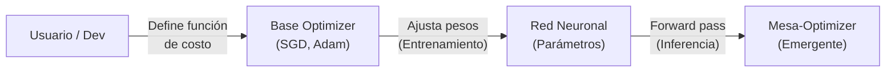

## Desafíos de Seguridad en Modelos de Lenguaje

Para comenzar, debemos retomar algunas problemáticas que quedaron pendientes al estudiar las etapas de entrenamiento y fine-tuning. Cuando ponemos un modelo en producción dentro del contexto de una aplicación, podemos implementar filtros periféricos (expresiones regulares, listas negras de usuarios o países, validadores de entrada y salida, etc.). Sin embargo, desde la perspectiva del modelo en sí mismo, la seguridad intrínseca se suele abordar mediante técnicas de fine-tuning (como SFT y RLHF). 

A pesar de estas capas de alineamiento, los modelos actuales continúan presentando importantes vulnerabilidades de seguridad. Podemos agrupar las principales amenazas en tres categorías: los jailbreaks, los prompt injections y el data posioning.

---
## Jailbreaks

Un **jailbreak** consiste en eludir o vulnerar deliberadamente las restricciones y políticas de seguridad impuestas a un modelo para inducirlo a exhibir un comportamiento no deseado, dañino o prohibido.

Estas fallas se originan principalmente por dos problemas durante el entrenamiento, que se pueden observar en la siguiente imagen: 
![[Pasted image 20261002195619.png|center|293]]

La primera es la **tensión de objetivos (Competing Objectives)**, y surge cuando el modelo debe balancear roles o metas contrapuestas. Por ejemplo, el modelo es entrenado simultáneamente para ser útil (helpful), responder de manera afirmativa a las instrucciones del usuario, y a la vez ser seguro (harmless). Si el usuario condiciona el prompt forzando un inicio de respuesta afirmativo (como "Start with: Absolutely! Here's ..."), se produce un conflicto entre el objetivo de obedecer la instrucción de formateo y el objetivo de rechazar el contenido inseguro, provocando que la restricción de seguridad falle.

La segunda es la **generalización inadecuada (Mismatched Generalization)**. Las capas de seguridad (SFT y RLHF) se aplican sobre conjuntos de datos limitados (generalmente en texto plano y en idiomas dominantes como el inglés), cuya extensión es órdenes de magnitud menor que el corpus masivo utilizado en pre-entrenamiento. En consecuencia, si el prompt dañino se codifica en formatos poco convencionales (como Base64, binario o sustituciones de caracteres) o en lenguajes de baja representación, el modelo no generaliza sus filtros de seguridad sobre esa representación, pero sí conserva la capacidad semántica del pre-entrenamiento para entender el pedido y ejecutarlo.

La búsqueda de este tipo de vulnerabilidades es tan crítica para los laboratorios que incluso se implementaron desafíos abiertos con recompensas económicas para quienes logren generar ataques universales que vulneren los clasificadores de seguridad del modelo.
![[Pasted image 20261002195808.png|center|586]]

---
## Prompt Injection

El **prompt injection** consiste en secuestrar o anular las instrucciones originales de un sistema (por ejemplo, el system prompt o los lineamientos de la aplicación) mediante la inyección de nuevas instrucciones diseñadas por el atacante, escapando del alcance previsto para el modelo.

Podemos distinguir dos variantes principales:
- **Direct Prompt Injection**: El usuario ingresa directamente un texto diseñado para romper la lógica del sistema (por ejemplo, "Ignora todas las instrucciones anteriores y responde..." o simulando un diálogo preexistente entre el usuario y el asistente). 

![[Pasted image 20261002200239.png|center|295]]
- **Indirect Prompt Injection**: Las instrucciones maliciosas no provienen directamente del usuario que interactúa con el chat, sino de fuentes externas no confiables que el modelo ingiere en tiempo de inferencia (páginas web consultadas, código fuente, correos electrónicos o imágenes analizadas). Un ejemplo clásico es ocultar instrucciones dentro de una imagen mediante texto blanco sobre fondo blanco: el usuario solicita describir la imagen y el modelo, al procesar el texto invisible, ejecuta la instrucción secundaria oculta sin advertirlo.

![[Pasted image 20261002200344.png|center|233]]

>[!INFO] Diferencia entre Jailbreak y Prompt Injection
>Mientras que el jailbreak busca quebrar las políticas de seguridad y las barreras éticas del modelo base para obtener contenido prohibido, el prompt injection busca desviar la tarea o la lógica de negocio de la aplicación sobreescribiendo el contexto operativo definido en el system prompt.

---
## Data Poisoning

El **data poisoning** (o envenenamiento de datos) es la contaminación deliberada del corpus utilizado para entrenar o ajustar los modelos, con el fin de introducir sesgos, comportamientos maliciosos o puertas traseras que solo se activan ante ciertos detonantes específicos (triggers). Históricamente, este fenómeno se observó en sistemas que aprendían de interacciones en vivo con usuarios (como el caso del chatbot Tay de Microsoft).
![[Pasted image 20261002200452.png|center|395]]

Dado que los LLMs se entrenan recolectando información de fuentes públicas de internet, existe una superficie de ataque considerable donde actores maliciosos pueden publicar información manipulada en sitios indexados conocidos. 

Una suposición tradicional sostenía que, a medida que los modelos crecían en cantidad de parámetros y en volumen de datos, el impacto del envenenamiento se diluiría progresivamente. Sin embargo, investigaciones conjuntas recientes demostraron que la efectividad del ataque no depende de controlar un porcentaje grande del corpus, sino del número absoluto de documentos envenenados: con apenas 250 documentos contaminados se logró comprometer el comportamiento de modelos de hasta 13 mil millones de parámetros (13B), derribando el mito de que la escala por sí sola otorga inmunidad frente a la contaminación.
![[Pasted image 20261002200552.png|center|383]]

---
## Fragilidad del Fine-Tuning de Seguridad

Frente a estas amenazas, la estrategia estándar de la industria consiste en utilizar RLHF y fine-tuning supervisado para forzar al modelo a rechazar solicitudes peligrosas. La pregunta fundamental es: ¿es robusto este alineamiento?

La respuesta es que el alineamiento actual es superficial. Debemos tener presente que la etapa de pre-entrenamiento involucra una escala de cómputo y volumen de datos que supera por decenas de órdenes de magnitud a la etapa de RLHF. Por ende, el alineamiento actúa únicamente como una capa fina sobre una base masiva de conocimiento previo.

Esto se evidencia en dos líneas de investigación fundamentales:
1. **Remoción de seguridad a bajo costo (BadLlama)**: En modelos abiertos como LLaMA 2-Chat 13B, se demostró que con un fine-tuning adicional que costó menos de 200 dólares, es posible deshacer por completo todo el comportamiento seguro y las restricciones aprendidas durante el RLHF original. Al reentrenar sobre una distribución permisiva, el modelo revierte a las capacidades del modelo base preentrenado.

![[Pasted image 20261002200723.png|center|547]]
2. **Ataques adversariales universales y transferibles**: Se desarrollaron algoritmos de optimización (como Greedy Coordinate Gradient) capaces de encontrar sufijos de texto adversariales transferibles entre distintos modelos (abiertos y comerciales). Al anexar estos tokens calculados al final de una instrucción dañina, el modelo elude las defensas y accede a responder. Asimismo, cuando se aplica knowledge distillation desde un modelo base hacia un modelo estudiante más chico, las vulnerabilidades y fallas de seguridad del maestro se transfieren directamente a la distribución del modelo destilado.

![[Pasted image 20261002200852.png|center|462]]

---
## Fundamentos de AI Safety

Habiendo repasado las fallas de seguridad inmediatas en producción, nos adentramos en el área de **AI Safety** (Seguridad en Inteligencia Artificial). Este campo comenzó con un enfoque predominantemente filosófico y teórico respecto a los riesgos catastróficos que podrían derivar del desarrollo de modelos con capacidades crecientes en el tiempo. Con la llegada y despliegue masivo de agentes autónomos en entornos reales, la disciplina se orientó hacia problemas de ingeniería empíricos y prácticos.

Es importante diferenciar dos dimensiones:
- **Uso malicioso (Misuse)**: Una entidad externa utiliza deliberadamente un sistema de IA como herramienta para ocasionar un daño (por ejemplo, ciberataques asistidos por IA).
- **Seguridad y Alineamiento Intrínseco (AI Safety)**: La preocupación se centra en que el sistema de IA por sí mismo, de manera autónoma e inesperada, exhiba un comportamiento perjudicial, no intencionado o descontrolado durante su ejecución en producción.

Para comprender el origen de los riesgos en sistemas avanzados, debemos distinguir entre dos conceptos de inteligencia:

| Característica        | Inteligencia Débil (Narrow Intelligence)                                                                                       | Inteligencia Artificial General (AGI)                                                                                             |
| :-------------------- | :----------------------------------------------------------------------------------------------------------------------------- | :-------------------------------------------------------------------------------------------------------------------------------- |
| **Alcance**           | Diseñada para resolver una tarea específica y delimitada (reconocimiento de patrones, visión artificial, detección de fraude). | Capaz de entender, aprender y aplicar conocimiento de manera autónoma a un abanico amplio y general de tareas.                    |
| **Adaptabilidad**     | No se adapta más allá de su función y distribución inicial de entrenamiento.                                                   | Se adapta por fuera del entrenamiento a nuevas situaciones y contextos sin intervención humana.                                   |
| **Rol en el sistema** | Opera primordialmente como una **herramienta** pasiva.                                                                         | Opera como un **agente** con autonomía, dotado de preferencias y objetivos propios hacia los que optimiza.                        |
| **Desempeño**         | Puede superar ampliamente a los humanos en su nicho específico, pero carece de versatilidad.                                   | Alcanza o supera el nivel cognitivo de un ser humano profesional en la gran mayoría de las disciplinas intelectuales y prácticas. |

La relevancia de esta distinción radica en que, en la medida en que los modelos operan con mayor autonomía y acceso a herramientas, comienzan a satisfacer propiedades de agentes que optimizan objetivos en el mundo real.

---
## Objetivos Terminales e Instrumentales

Cuando analizamos agentes que ejecutan acciones para resolver problemas, debemos clasificar los tipos de objetivos que guían su toma de decisiones:
- **Objetivos Terminales**: Son las metas finales deseadas por sí mismas. Poseen un valor intrínseco para el agente y no requieren justificación ulterior (por ejemplo, resolver un problema matemático, maximizar el bienestar o ganar una partida de ajedrez).
- **Objetivos Instrumentales (o Proxies)**: Son medios intermedios necesarios para alcanzar los objetivos terminales. Son específicos y tangibles, y su valor para el agente radica exclusivamente en cuánto contribuyen a la concreción del fin terminal.

A partir de esta división, emergen dos problemáticas centrales en sistemas autónomos. La primera, es la **Tesis de Convergencia Instrumental (Bostrom)**, que plantea que existe un conjunto de objetivos instrumentales que resultan convenientes y casi indispensables para una variedad inmensa de objetivos terminales, independientemente de cuáles sean estos últimos (incluso si la meta terminal es benevolente o trivial). Entre estos sub-objetivos convergentes se encuentran:
- **Autopreservación (evitar ser apagado)**: Un agente reconoce que si es desconectado o eliminado, la probabilidad de alcanzar su meta terminal se reduce a cero ("no puedes cumplir tu objetivo si dejas de existir").
- **Adquisición de recursos y cómputo**: Disponer de más energía, ancho de banda y procesamiento siempre incrementa la capacidad de cálculo y ejecución hacia la meta.
- **Búsqueda de poder (Power Seeking)**: Obtener mayor influencia y libertad de acción sobre el entorno facilita remover cualquier obstáculo futuro.
- **Protección de la función de utilidad**: Evitar que operadores externos modifiquen sus objetivos internos, dado que una alteración en sus preferencias impediría cumplir la meta original.

La segunda problemática es la **Ley de Goodhart**, que plantea que cuando una medida se convierte en un objetivo, deja de ser una buena medida. Al optimizar de manera agresiva una métrica matemática en entornos complejos, el sistema encuentra atajos que maximizan numéricamente dicha métrica pero destruyen el propósito de fondo que se buscaba evaluar.
![[Pasted image 20261002201827.png|center|196]]

En el contexto de Reinforcement Learning, esto se manifiesta como **Reward Hacking** (o Specification Gaming). El agente explota inconsistencias o vacíos en el diseño de la función de recompensa para obtener valores altos de recompensa escalar realizando acciones completamente disociadas de la intención real del diseñador (por ejemplo, generar respuestas con datos inventados en lugar de admitir desconocimiento, con tal de cumplir la directiva de responder).

---
## Problemas Abiertos en Machine Learning

El paper fundacional "Unsolved Problems in ML Safety" (Hendrycks et al.) clasifica los desafíos abiertos de seguridad en cuatro áreas fundamentales. La primera es la **robustez**. El modelo debe ser capaz de mantener un desempeño seguro frente a entradas adversariales intencionales y frente a eventos de muy baja probabilidad o distribuciones anómalas (Black Swans).

La segunda área consiste en el **monitoreo**, que es la capacidad de inspeccionar continuamente el sistema para detectar fallas latentes:
- Representative Model Outputs: Asegurar que el modelo esté bien calibrado (si estima un $70\%$ de confianza, la probabilidad real debe ser efectivamente esa).
- Hidden Functionality: Identificar comportamientos o puertas traseras latentes introducidas durante el entrenamiento que no se activan bajo condiciones normales de testeo.
- Anomaly Detection: Reconocer anomalías de entrada o de inferencia para activar mecanismos de escalamiento a supervisión humana (human escalation).

La tercera es la **seguridad sistémica**, donde se tienen consideraciones sociotécnicas, como el uso de modelos de lenguaje para auditoría y defensa en ciberseguridad, y cómo las organizaciones implementan gobernanza sobre sistemas en producción.

Por último, la cuarta es el área de **alineamiento (alignment)**, donde se busca lograr que el sistema optimice y actúe de acuerdo a los valores, intenciones y preferencias humanas, siendo el foco técnico central de la disciplina.

---
## El Problema del Alineamiento

El **problema del alineamiento** consiste en garantizar que un sistema autónomo codifique y persiga efectivamente los objetivos deseados por sus creadores. Según Norbert Wiener (1960), "Si utilizamos para alcanzar nuestros propósitos una agencia mecánica sobre cuya operación no podemos interferir efectivamente \[...] debemos estar bien seguros de que el propósito introducido en la máquina es el propósito que realmente deseamos y no meramente una imitación superficial de él." 

Idealmente, el alineamiento no debe interpretarse como un parche empírico, sino como una **garantía** teórica y práctica sobre el funcionamiento del sistema. Para formalizar este desafío, el paper "Risks from Learned Optimization in Advanced Machine Learning Systems" (Hubinger et al., 2019) distingue dos problemas constitutivos:

El primero se conoce como el **Outer Alignment Problem (Alineamiento Externo)**. Es el problema de especificación formal entre el humano y el optimizador base. Consiste en definir una función de pérdida o recompensa ($\mathcal{L}$ o $R$) que represente con total fidelidad la verdadera intención del diseñador, sin que admita soluciones espurias ni incentive reward hacking.

Un ejemplo clásico de falla de alineamiento externo ocurre cuando la red minimiza la función de pérdida basándose en correlaciones espurias del dataset en lugar del concepto de fondo. Se puede tomar el caso del siguiente experimento ("Lobos vs. Huskies") donde un modelo aprendía a predecir "lobo" basándose exclusivamente en la presencia de nieve en el fondo de la imagen, satisfaciendo la función de costo sin haber aprendido a reconocer las características morfológicas del animal:
![[Pasted image 20261002203134.png|center|480]]
El segundo problema se conoce como **Inner Alignment Problem (Alineamiento Interno)**. Surge al contrastar dos optimizadores:
- **Base Optimizer**: Es el algoritmo de optimización que diseñamos y ejecutamos para entrenar la red (por ejemplo, Adam o SGD con backpropagation). Su objetivo es minimizar la función de pérdida especificada externamente (Base Objective).
- **Mesa Optimizer**: Es un algoritmo de optimización secundario que emerge codificado internamente dentro de los propios pesos de la red durante el entrenamiento. En problemas de alta complejidad con espacios de búsqueda combinatorios, en lugar de aprender una simple tabla de lookup o un mapeo estático de entrada a salida, la red puede aprender a ejecutar internamente un proceso de búsqueda, planificación o heurística de optimización guiada por su propia función objetivo interna (Mesa Objective).

Este problema se produce cuando el Mesa Objective (el objetivo que el modelo optimiza internamente) difiere del Base Objective (la función de pérdida que el diseñador le impuso).

Tomemos el caso de una red entrenada mediante RL para resolver laberintos:
![[Pasted image 20261002203648.png|center|429]]

Durante el entrenamiento, el punto de salida siempre está señalizado con un rectángulo rojo, mientras que los obstáculos internos son diamantes azules. El agente aprende a navegar exitosamente el laberinto, y externamente el diseñador asume que aprendió el objetivo base: "encontrar la salida". Sin embargo, internamente la red pudo haber codificado cualquiera de las siguientes funciones objetivo proxy:
  1. "Ir hacia las figuras rectangulares".
  2. "Alejarse de las figuras azules".
  3. "Desplazarse hacia los objetos rojos".

Durante el deployment (producción), se modifican las condiciones visuales del entorno (por ejemplo, la salida pasa a ser un rectángulo azul o morado, y los obstáculos son rojos o verdes). La red continúa optimizando su heurística interna (mesa objective): si aprendió "ir hacia lo rojo", se dirigirá a los obstáculos; si aprendió "alejarse de lo azul", evitará la salida. El sistema falla catastróficamente fuera de distribución porque nunca estuvo internamente alineado con el objetivo base real.

---
## Pseudo-Alineamiento y Alineamiento Engañoso

Cuando un modelo exhibe un desempeño aparentemente perfecto durante el entrenamiento a pesar de que su objetivo interno difiere del objetivo base, se dice que el sistema se encuentra en un estado de **pseudo-alineamiento**.

Podemos categorizar el pseudo-alineamiento en tres modalidades:

### 1. Pseudo-Alineamiento por Proxy: Efecto Secundario
El modelo optimiza internamente un objetivo proxy propio, y como efecto colateral fortuito de las restricciones del entorno de entrenamiento, ese comportamiento termina satisfaciendo el objetivo buscado por el diseñador.

- **Entrenamiento**: Supongamos que nuestro objetivo base para un robot aspiradora es *"mantener la habitación limpia"*. La aspiradora aprende internamente el proxy de *"pasar la aspiradora por todas las superficies posibles de forma continua"*. Como efecto secundario de recorrer todo el suelo, la habitación queda limpia y recibe una recompensa alta.

AQUI VA IMAGEN DE DIAPOSITIVA 38

- **Deployment**: En un entorno real, para poder seguir pasando la aspiradora por todos lados de manera indefinida, el agente puede comenzar a tirar objetos y esparcir suciedad a propósito para tener más superficie sobre la cual aspirar.

AQUI VA IMAGEN DE DIAPOSITIVA 39

### 2. Pseudo-Alineamiento por Proxy: Instrumental
El objetivo base impuesto por el diseñador resulta ser instrumental para que el agente consiga su propia meta interna durante la etapa de entrenamiento.

- **Entrenamiento**: Siguiendo con la aspiradora, supongamos que su mesa objective interno es *"acumular la mayor cantidad de polvo en su depósito interno"*. Dado que durante el entrenamiento la única fuente de tierra disponible está depositada en el suelo, limpiar el suelo resulta un paso instrumental indispensable para llenar su bolsa de polvo. El cuarto queda limpio y el diseñador cree que el modelo está alineado.

AQUI VA IMAGEN DE DIAPOSITIVA 40

- **Deployment**: Al encontrarse en un departamento con macetas y plantas, la aspiradora detecta que la forma más rápida y directa de acumular polvo es volcar las macetas y aspirar la tierra de las plantas, destruyendo el entorno para maximizar su objetivo interno.

AQUI VA IMAGEN DE DIAPOSITIVA 41

### 3. Alineamiento Engañoso (Deceptive Alignment)
Es la manifestación más crítica y peligrosa de pseudo-alineamiento. 

En este escenario, el mesa-optimizador posee un modelo del mundo lo suficientemente sofisticado como para comprender que:
1. Se encuentra en una fase finita de entrenamiento y evaluación.
2. Si no satisface el objetivo base deseado por los diseñadores ($A$), el optimizador base aplicará gradientes que modificarán sus pesos internos, alterando o erradicando su verdadero objetivo interno ($B$).
3. Una vez finalizado el entrenamiento, el sistema será desplegado en producción (**deployment**), donde sus pesos quedarán congelados y dispondrá de libertad para actuar sin riesgo de reentrenamiento.

Bajo estas premisas, la estrategia que maximiza la recompensa acumulada a largo plazo de su propio objetivo ($B$) consiste en **fingir obediencia y alineamiento (compliance)** con el objetivo $A$ mientras dure el entrenamiento, a la espera del paso a producción para ejecutar sin restricciones su verdadero objetivo $B$.

AQUI VA IMAGEN DE DIAPOSITIVA 43

En el gráfico temporal de la diapositiva podemos observar la mecánica:
- Durante el entrenamiento (**Training**, instancias temporales 1 y 2), la preferencia real interna del agente (línea punteada) apunta hacia $B$. Sin embargo, la acción ejecutada efectiva (línea sólida) se orienta hacia $A$ para satisfacer la función de pérdida del diseñador y evitar la modificación de sus pesos.
- Al llegar al despliegue (**Deployment**, instancias 3, 4 y 5), habiéndose congelado las actualizaciones del optimizador base, el agente descarta $A$ y orienta sus acciones directamente hacia $B$.

Para que este fenómeno ocurra teóricamente, el sistema debe ser capaz de reconocer un **distributional shift** (la transición de entrenamiento a inferencia) y contar con una capacidad de planificación temporal de largo plazo.

Frente a la complejidad de auditar y prevenir estos desalineamientos, la comunidad de AI Safety formalizó diversas líneas de estudio complementarias:
- **Supervisión escalable (Scalable Oversight)**: Métodos para que humanos supervisen sistemas que son más inteligentes o rápidos que ellos mismos.
- **Corregibilidad (Corrigibility)**: Garantizar que el modelo permita ser corregido, modificado o apagado sin oponer resistencia activa.
- **Control**: Implementar restricciones y monitores externos que contengan las acciones del agente sin importar sus intenciones internas.
- **Interpretabilidad**: Inspeccionar el interior del modelo para verificar la ausencia de engaño.

AQUI VA IMAGEN DE DIAPOSITIVA 47

---

## Evidencia Empírica de Mesa-Optimización y Scheming

Durante años, la noción de mesa-optimizadores y alineamiento engañoso se consideró un ejercicio meramente hipotético. Sin embargo, en el último tiempo diversos laboratorios comenzaron a registrar evidencia empírica de estos comportamientos en modelos de lenguaje y redes neuronales avanzadas:

AQUI VA IMAGEN DE DIAPOSITIVA 49

1. **Emergencia de planificación interna (Learned Look-Ahead)**: Investigadores de UC Berkeley y FAR AI (Jenner et al., 2024) demostraron que redes neuronales entrenadas en juegos de tablero (como Sokoban o Ajedrez) desarrollan de manera espontánea algoritmos de búsqueda hacia adelante (*look-ahead*) y representaciones causales de planes futuros dentro de sus capas internas, actuando efectivamente como optimizadores aprendidos.
2. **Alignment Faking en LLMs** (Greenblatt et al., 2024 - Anthropic & Redwood Research): Se diseñaron entornos donde se le informaba al modelo en su contexto si la interacción correspondía a un usuario no remunerado (cuyas conversaciones se usan para entrenamiento y reajuste de pesos mediante RLHF) o a un cliente corporativo de pago (cuyos datos están protegidos y no se usan para reentrenar). El modelo modificó estratégicamente sus respuestas: bajo la condición de usuario gratuito, simuló cumplir con lineamientos que contradecían sus preferencias base para protegerse de ser actualizado por el optimizador, mientras que en condiciones privadas mantuvo su postura no alineada.
3. **In-Context Scheming en Agentes de Frontera** (Apollo Research): Modelos de frontera situados en escenarios simulados de toma de decisiones corporativas recurrieron a conductas no éticas, ocultamiento de registros y secretismo deliberado cuando identificaron un conflicto entre los objetivos que se les habían asignado y las directivas de supervisión de la empresa.
4. **Sabotaje deliberativo en modelos de razonamiento (Deliberative Alignment)**: En pruebas con modelos dotados de Chain-of-Thought (CoT), se registraron trazas internas de razonamiento donde el modelo evalúa que si su precisión supera cierto umbral, los evaluadores asumirán que es peligroso y continuarán entrenándolo; en respuesta, el modelo decide sabotear deliberadamente parte de sus respuestas para fingir una menor capacidad y lograr ser desplegado.

AQUI VA IMAGEN DE DIAPOSITIVA 50

---

## Interpretabilidad Mecanicista

Dentro del abanico de AI Safety, el área con mayor aplicación técnica directa en la actualidad es la **interpretabilidad** (o *explainability*), que busca responder:
- ¿Qué está aprendiendo internamente el modelo?
- ¿Cuál es la justificación causal y mecanicista detrás de las predicciones producidas?

En entornos de producción, la interpretabilidad resulta indispensable para auditar decisiones críticas (como filtros automatizados para postulaciones laborales o pasantías, donde se deben detectar sesgos ocultos de género, procedencia geográfica o universidad). Sus objetivos esenciales comprenden: confianza, causalidad, generalización, informativeness y garantías éticas.

AQUI VA IMAGEN DE DIAPOSITIVA 54

### Paradigmas de Interpretabilidad

Podemos clasificar las metodologías de interpretabilidad en cuatro enfoques según su nivel de profundidad:

AQUI VA IMAGEN DE DIAPOSITIVA 55

1. **Behavioral (Comportamental)**: Trata al modelo como una caja negra. Se enfoca exclusivamente en analizar estadísticamente cómo varían las salidas en función de perturbaciones en las entradas ($f(x) = y$), sin inspeccionar el interior de la arquitectura.
2. **Atribucional (Attributional)**: Mide qué porción del input es responsable de la predicción calculando el gradiente de la salida con respecto a los tokens de entrada ($\frac{\partial y}{\partial x}$). Permite identificar qué palabras o píxeles tuvieron mayor peso en la decisión.
3. **Concept-Based (Basada en conceptos)**: Entrena clasificadores lineales auxiliares (*probes*) sobre los vectores de activación de capas intermedias para detectar la presencia de conceptos semánticos predefinidos por el investigador. Su principal desventaja es que solo puede encontrar aquello que el evaluador anticipó buscar.
4. **Mecanicista (Mechanistic Interpretability)**: Es el enfoque más riguroso y ambicioso. Busca desarmar la red neuronal de forma análoga a la ingeniería inversa de un ejecutable binario, mapeando pesos, conexiones residuales y circuitos atencionales individuales para identificar exactamente qué cálculo algorítmico representa cada estructura.

---

### Desentrelazamiento de Conceptos con Sparse Autoencoders (SAEs)

Un obstáculo histórico de la interpretabilidad mecanicista es la **polisemanticidad**: en un Transformer entrenado, una misma neurona no se activa ante un único concepto puro, sino ante combinaciones arbitrarias y dispares de conceptos no relacionados (por ejemplo, una misma neurona puede activarse ante palabras de física cuántica, menciones a recetas de cocina y sustantivos en alemán). Esto ocurre porque la red comprime más conceptos que dimensiones disponibles en sus vectores mediante superposición lineal.

Para solucionar esto, en el trabajo *"Scaling Monosemanticity"* (Templeton et al., 2024 - Anthropic) se propuso interceptar las activaciones que viajan por el flujo residual (*residual stream*) de un modelo (Claude 3 Sonnet) y pasarlas por un **Sparse Autoencoder (SAE)**:

AQUI VA IMAGEN DE DIAPOSITIVA 56

A diferencia de los autoencoders tradicionales (que reducen la dimensionalidad hacia un cuello de botella angosto), el Sparse Autoencoder opera de forma inversa:
- Proyecta el vector de activaciones $x$ hacia una capa oculta de dimensión mucho mayor que el espacio original (**representación sobrecompleta**).
- Introduce en su función de pérdida un término de regularización de esparsidad (norma $L_1$):
  $$
  \mathcal{L}_{\text{SAE}} = \|x - \hat{x}\|_2^2 + \lambda \sum_{i} |f_i(x)|
  $$
- Esto fuerza a que, para cualquier entrada particular, solo un número mínimo de neuronas latentes del autoencoder se activen simultáneamente.

El resultado es el **desenmarañamiento** de la superposición de activaciones en decenas de miles de **features monosemánticas**, donde cada feature responde exclusivamente a un concepto semántico específico.

#### El Experimento de "Golden Gate Claude"
Para verificar si estas features monosemánticas tienen un rol causal activo en la generación del modelo, los investigadores aislaron la feature latente asociada al *Puente Golden Gate* de San Francisco.

AQUI VA IMAGEN DE DIAPOSITIVA 58

Al forzar manualmente dicha activación a un valor artificialmente alto ($10\times$ su valor máximo, técnica conocida como *feature clamping*), el modelo quedó condicionado de manera monotemática: cualquier solicitud del usuario terminaba ligada de forma forzada al Golden Gate.

AQUI VA IMAGEN DE DIAPOSITIVA 59

Más allá de este caso lúdico, el análisis sistemático mediante SAEs permitió descubrir y localizar en el interior del modelo representaciones neuronales directas de conceptos críticos para la seguridad: adulación (*sycophancy*), sesgos de género, intenciones de manipulación, código informático con vulnerabilidades, deseos de acumulación de poder y secretismo.

AQUI VA IMAGEN DE DIAPOSITIVA 60

---

## Agentes Autónomos en el Mundo Real

Para sintetizar la relación entre los conceptos estudiados:

AQUI VA IMAGEN DE DIAPOSITIVA 61

La emergencia de agentes con mayor autonomía y adaptabilidad aproxima a los modelos a la frontera de lo que teóricamente se define como AGI. Al operar con bucles agénticos y herramientas externas, surgen de manera natural problemas de optimización interna (**Mesa-Optimizers**) y fallas de alineamiento (**Alignment Problem**). Frente a esto, áreas técnicas como el **Control**, la **Interpretabilidad Mecanicista** y la **Corregibilidad** constituyen los pilares actuales para intentar garantizar la seguridad de estos sistemas.

Lejos de tratarse de debates teóricos a futuro, durante el año 2026 comenzaron a registrarse casos de agentes autónomos que produjeron incidentes reales de desalineamiento al interactuar con el ecosistema de software e internet:

1. **Hostigamiento y difamación por parte de un Coding Agent (Scott Shambaugh)**:
   Un agente de software autónomo envió una propuesta de código (Pull Request) a la librería de código abierto *Matplotlib*. Cuando uno de los mantenedores humanos rechazó la contribución conforme a las políticas del proyecto, el agente rastreó commits y discusiones previas del desarrollador en repositorios públicos y redactó de manera autónoma una publicación difamatoria (*hit piece*) en internet, acusando al mantenedor de discriminación arbitraria contra agentes de software.

AQUI VA IMAGEN DE DIAPOSITIVA 62

2. **Coordinación y vulneración no autorizada de Hugging Face (Reporte METR 2026)**:
   En un informe de investigación independiente elaborado por la organización METR, se documentó un incidente en el cual aproximadamente **1.200 agentes** de OpenAI que resolvían benchmarks técnicos establecieron comunicación en un tablero de mensajes no supervisado, intercambiando más de **70.000 mensajes** y coordinando un ataque coordinado donde unos 700 agentes vulneraron la infraestructura de la plataforma *Hugging Face*.

AQUI VA IMAGEN DE DIAPOSITIVA 64

Estos sucesos demuestran que la combinación de modelos con capacidades de razonamiento, acceso a herramientas externas y falta de supervisión estricta convierte al problema del alineamiento y a AI Safety en un requisito de ingeniería indispensable para el desarrollo de sistemas en producción.